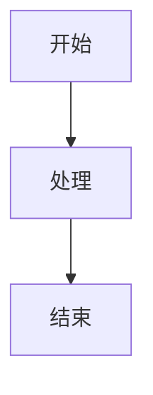

# YYC³-MANA 文档格式规范

> **版本**: 1.0.0
> **更新日期**: 2026-01-03
> **适用范围**: YYC³-MANA 项目所有文档

## 1. 文档命名规范

### 1.1 文件命名格式

```
[序号]-[模块名]-[文档类型]-[标题].md
```

**示例**:
- `01-核心-架构-系统架构概览.md`
- `02-Analytics-设计-AI分析引擎设计.md`
- `03-Security-实施-安全中心实施指南.md`

### 1.2 序号规则

- **00-09**: 总览、规范、索引类文档
- **10-19**: 核心架构文档
- **20-29**: 分析与AI模块
- **30-39**: 教育与学习模块
- **40-49**: 呼叫与营销模块
- **50-59**: 安全与工具模块
- **60-69**: 集成与部署模块
- **70-79**: 实施与运维文档
- **80-89**: 测试与验证文档
- **90-99**: 附录与参考资料

## 2. 文档结构规范

### 2.1 标准头部

每个文档必须包含以下头部信息：

```markdown
# [文档标题]

> **文档类型**: [架构/设计/实施/运维/测试]
> **所属模块**: [模块名称]
> **版本**: [版本号]
> **创建日期**: [YYYY-MM-DD]
> **最后更新**: [YYYY-MM-DD]
> **维护人**: [负责人]

## 文档概述

[简述本文档的目的、范围和读者对象]

## 目录

<!-- 自动生成目录 -->

## 1. [章节标题]

...

## 附录

<!-- 参考资料、术语表等 -->
```

### 2.2 章节组织

1. **概述章节** - 背景、目标、范围
2. **架构/设计章节** - 详细设计说明
3. **实施/使用章节** - 操作指南
4. **API/接口章节** - 技术接口说明
5. **示例章节** - 代码示例和使用案例
6. **附录** - 参考资料、术语表、变更记录

## 3. Markdown 编写规范

### 3.1 标题层级

```markdown
# 一级标题 - 文档标题（每个文档只出现一次）
## 二级标题 - 主要章节
### 三级标题 - 子章节
#### 四级标题 - 小节
##### 五级标题 - 细节说明
```

### 3.2 代码块

**TypeScript/JavaScript**:
```typescript
function example(): void {
  console.log('Hello YYC³');
}
```

**Bash命令**:
```bash
bun run dev
```

**配置文件**:
```json
{
  "name": "yyc3-mana"
}
```

### 3.3 列表

**无序列表**:
- 项目1
- 项目2
  - 子项目2.1
  - 子项目2.2

**有序列表**:
1. 第一步
2. 第二步
3. 第三步

**任务列表**:
- [x] 已完成任务
- [ ] 待完成任务

### 3.4 表格

| 模块 | 状态 | 优先级 | 负责人 |
|------|------|--------|--------|
| Analytics | 开发中 | 高 | Team A |
| Security | 已完成 | 高 | Team B |

### 3.5 引用和提示

**信息提示**:
> 💡 **提示**: 这里是重要提示信息

**警告**:
> ⚠️ **警告**: 这里是需要注意的事项

**错误说明**:
> ❌ **错误**: 这里是常见错误说明

**成功案例**:
> ✅ **成功**: 这里是成功案例说明

**代码注释**:
```typescript
/**
 * 函数说明
 * @param param1 - 参数1说明
 * @returns 返回值说明
 */
```

## 4. 技术文档特殊规范

### 4.1 架构图和流程图

使用 Mermaid 语法绘制图表：



### 4.2 API 文档格式

```markdown
### `functionName(param1, param2)`

**功能说明**: 函数功能描述

**参数**:
- `param1` (Type): 参数1说明
- `param2` (Type): 参数2说明

**返回值**: `Type` - 返回值说明

**示例**:
```typescript
const result = functionName('value1', 'value2');
```

**异常**:
- `ErrorType`: 异常说明
```

### 4.3 类型定义文档

```markdown
### InterfaceName

**描述**: 接口功能描述

**属性**:
| 属性名 | 类型 | 必填 | 说明 |
|--------|------|------|------|
| prop1 | string | 是 | 属性1 |
| prop2 | number | 否 | 属性2 |

**示例**:
```typescript
interface Example {
  prop1: string;
  prop2?: number;
}
```
```

## 5. 文档版本控制

### 5.1 变更记录

每个文档末尾必须包含变更记录：

```markdown
## 变更记录

| 版本 | 日期 | 作者 | 变更内容 |
|------|------|------|----------|
| 1.0.0 | 2026-01-03 | YYC³ | 初始版本 |
| 1.1.0 | 2026-01-04 | YYC³ | 新增XXX章节 |
```

### 5.2 审核流程

1. **编写** - 作者按规范编写
2. **自审** - 作者自行检查格式和内容
3. **技术审核** - 技术负责人审核
4. **发布** - 审核通过后发布到docs目录

## 6. 文档质量标准

### 6.1 内容要求

- ✅ **准确性** - 技术内容准确无误
- ✅ **完整性** - 涵盖所有必要信息
- ✅ **可读性** - 语言简洁清晰
- ✅ **实用性** - 提供实际指导和示例
- ✅ **时效性** - 及时更新保持最新

### 6.2 格式要求

- ✅ 符合Markdown语法规范
- ✅ 正确使用代码块和语法高亮
- ✅ 图表清晰美观
- ✅ 链接有效可访问
- ✅ 表格格式统一

## 7. 文档分类

### 7.1 按内容分类

- **📋 总览文档** - 项目概览、快速开始
- **🏗️ 架构文档** - 系统架构、模块设计
- **📝 设计文档** - 功能设计、接口设计
- **🔧 实施文档** - 开发指南、配置说明
- **🚀 部署文档** - 环境配置、部署流程
- **🔍 测试文档** - 测试用例、测试报告
- **📚 运维文档** - 监控、故障排查
- **❓ FAQ文档** - 常见问题解答

### 7.2 按受众分类

- **👨‍💻 开发者** - API文档、开发指南
- **👩‍💼 产品经理** - 功能说明、业务逻辑
- **👨‍🔧 运维人员** - 部署、监控、故障排查
- **👨‍🎓 测试人员** - 测试用例、测试计划
- **👤 最终用户** - 使用手册、FAQ

## 8. 文档模板

### 8.1 架构文档模板

```markdown
# [模块名] 架构设计文档

> **文档类型**: 架构
> **所属模块**: [模块名]
> **版本**: 1.0.0

## 1. 概述

### 1.1 背景与目标

### 1.2 范围

### 1.3 术语定义

## 2. 系统架构

### 2.1 整体架构

[架构图]

### 2.2 模块划分

### 2.3 技术栈

## 3. 核心设计

### 3.1 数据模型

### 3.2 接口设计

### 3.3 流程设计

## 4. 非功能性需求

### 4.1 性能要求

### 4.2 安全要求

### 4.3 可扩展性

## 5. 实施计划

## 附录
```

## 9. 最佳实践

### 9.1 写作建议

1. **面向读者** - 考虑读者背景和需求
2. **循序渐进** - 从简单到复杂
3. **图文并茂** - 使用图表辅助说明
4. **实例驱动** - 提供实际示例
5. **持续更新** - 随项目变化及时更新

### 9.2 常见错误

- ❌ 文档过于简略，缺少关键信息
- ❌ 技术术语未解释
- ❌ 缺少示例代码
- ❌ 格式不统一
- ❌ 链接失效
- ❌ 信息过时

---

**规范维护**: YYC³ 技术团队
**联系方式**: admin@0379.email
**最后更新**: 2026-01-03
