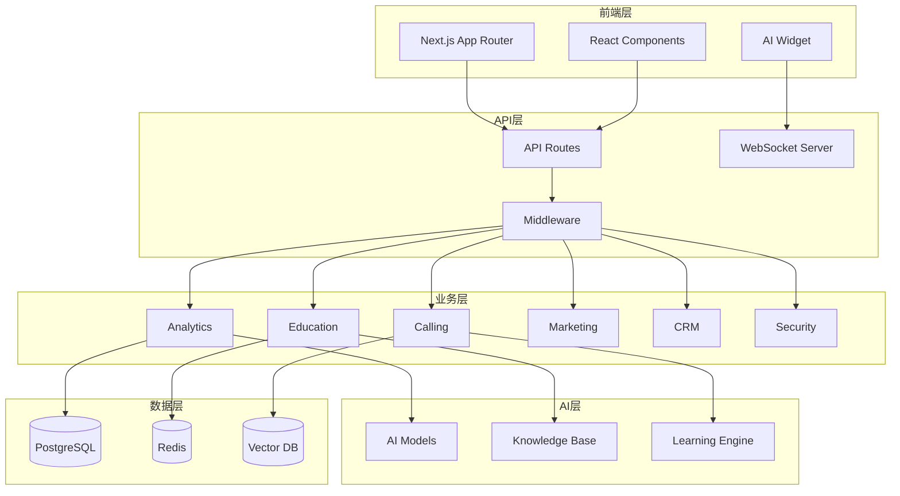
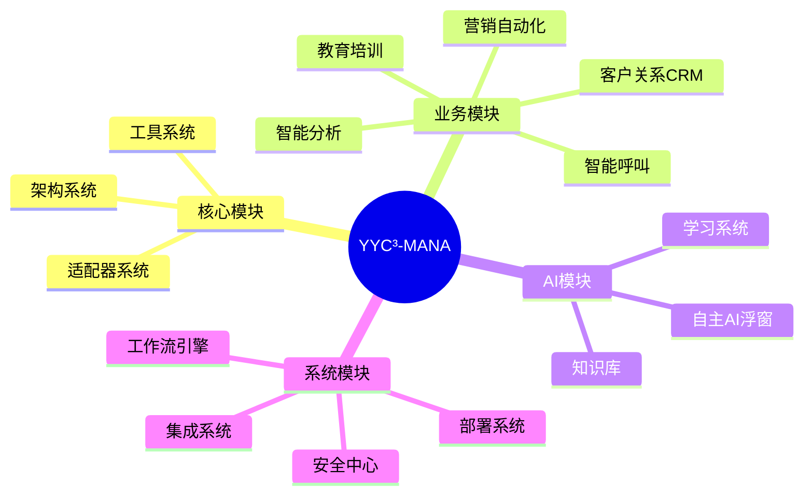
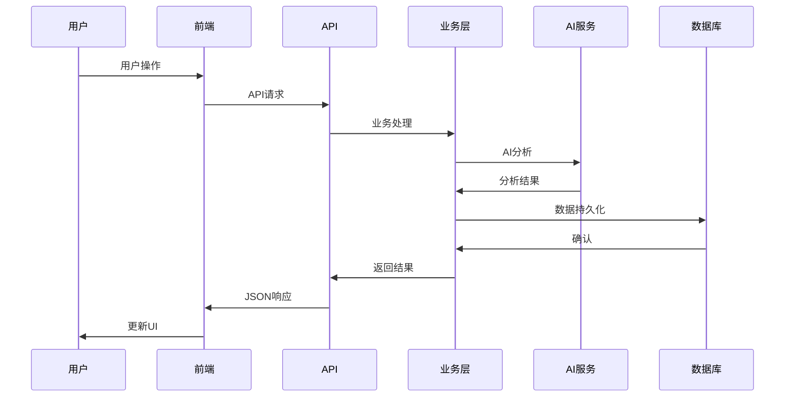

# YYC³-MANA 系统架构概览

> **文档类型**: 架构
> **所属模块**: 核心系统
> **版本**: 1.0.0
> **创建日期**: 2026-01-03
> **最后更新**: 2026-01-03
> **维护人**: YYC³ 技术团队

## 1. 项目概述

### 1.1 项目简介

**YYC³-MANA** 是一个企业级智能管理系统，采用模块化、可插拔的架构设计，集成AI助手、客户管理、任务管理、智能分析等核心功能。

**项目名称**: YYC³-MANA (企业智能管理系统)
**技术栈**: Next.js 15 + TypeScript + Bun
**架构模式**: 微内核 + 插件化
**部署方式**: Docker + Kubernetes

### 1.2 核心特性

- 🧩 **模块化设计** - 17个独立功能模块，按需加载
- 🤖 **AI驱动** - 智能分析、自动化决策
- 📊 **实时分析** - 多维度数据分析与可视化
- 🔒 **企业级安全** - 完整的安全与合规体系
- 📈 **高可扩展** - 支持水平扩展和垂直扩展

### 1.3 技术亮点

```typescript
// 核心技术栈
{
  "frontend": "Next.js 15 (React 19)",
  "runtime": "Bun",
  "language": "TypeScript 5.7",
  "styling": "TailwindCSS + Radix UI",
  "state": "Redux Toolkit + RTK Query",
  "ai": "OpenAI / DeepSeek / Ollama",
  "database": "PostgreSQL + Redis",
  "deployment": "Docker + K8s"
}
```

## 2. 系统架构

### 2.1 整体架构图



### 2.2 分层架构

| 层级 | 职责 | 技术 |
|------|------|------|
| **表现层** | UI渲染、用户交互 | Next.js, React, TailwindCSS |
| **API层** | 路由、中间件、认证 | Next.js API Routes, NextAuth.js |
| **业务层** | 业务逻辑、数据处理 | TypeScript, Zod |
| **服务层** | AI服务、数据分析 | OpenAI, DeepSeek, Chart.js |
| **数据层** | 数据持久化、缓存 | PostgreSQL, Redis, Pinecone |

### 2.3 模块划分



## 3. 核心模块详解

### 3.1 架构系统 (Architecture)

**文件**: `core/architecture/`

**职责**: 系统架构设计和基础设施

**核心组件**:
- `DataHub` - 数据中心
- `AIOrchestrator` - AI编排器
- `ServiceRegistry` - 服务注册中心
- `EventBus` - 事件总线

### 3.2 智能分析 (Analytics)

**文件**: `core/analytics/`

**职责**: 数据分析、预测模型、可视化

**核心组件**:
- `AIAnalyticsEngine` - AI分析引擎
- `AIDecisionSupport` - AI决策支持
- `PredictiveAnalytics` - 预测分析
- `AnomalyDetection` - 异常检测
- `RealTimeAIDashboard` - 实时AI仪表板

### 3.3 教育培训 (Education)

**文件**: `core/education/`

**职责**: 智能培训、知识管理、技能评估

**核心组件**:
- `AICoachingSystem` - AI教练系统
- `IntelligentContentGenerator` - 智能内容生成
- `PersonalizedLearning` - 个性化学习
- `RealTimeCoaching` - 实时指导

### 3.4 智能呼叫 (Calling)

**文件**: `core/calling/`, `core/workflows/`

**职责**: 智能呼叫、工作流编排、客户生命周期

**核心组件**:
- `EnhancedCallingSystem` - 增强呼叫系统
- `IntelligentCallingWorkflow` - 智能呼叫工作流
- `CustomerLifecycleWorkflow` - 客户生命周期工作流
- `RealTimeCallAssistant` - 实时呼叫助手

### 3.5 营销自动化 (Marketing)

**文件**: `core/marketing/`

**职责**: 营销活动、客户旅程、自动化流程

**核心组件**:
- `AICampaignManager` - AI活动管理
- `AdvancedAutomation` - 高级自动化
- `AIMobileWorkbench` - AI移动工作台

### 3.6 客户关系管理 (CRM)

**文件**: `core/crm/`

**职责**: 客户数据、360度视图、关系管理

**核心组件**:
- `AdvancedCustomer360` - 高级客户360度视图

### 3.7 安全中心 (Security)

**文件**: `core/security/`

**职责**: 安全防护、合规管理、访问控制

**核心组件**:
- `ComprehensiveSecurityCenter` - 综合安全中心
- 威胁检测、合规管理、企业安全
- 灾难恢复、业务连续性

### 3.8 学习系统 (Learning)

**文件**: `core/learning/`

**职责**: 机器学习、知识管理、持续优化

**核心组件**:
- `FeedbackAnalyzerImpl` - 反馈分析器
- `KnowledgeBaseImpl` - 知识库实现
- `PatternRecognizerImpl` - 模式识别器

### 3.9 闭关系统 (Closed-Loop)

**文件**: `core/closed-loop/`

**职责**: 反馈循环、持续优化、性能监控

**核心组件**:
- `ClosedLoopSystem` - 闭关系统

### 3.10 AI浮窗 (Autonomous AI Widget)

**文件**: `core/autonomous-ai-widget/`

**职责**: 自主AI助手、智能对话、任务自动化

**核心组件**:
- `AutonomousAIEngine` - 自主AI引擎

## 4. 技术架构

### 4.1 前端架构

```typescript
// 目录结构
app/
├── (routes)/           // 页面路由
├── api/               // API路由
├── components/        // React组件
│   ├── ui/            // UI基础组件
│   ├── ai-模块/       // AI相关组件
│   └── layout/        // 布局组件
├── lib/               // 工具库
├── hooks/             // React Hooks
├── store/             // 状态管理
└── styles/            // 样式文件
```

**关键特性**:
- ✅ App Router - 文件系统路由
- ✅ Server Components - 服务端渲染
- ✅ Streaming SSR - 流式SSR
- ✅ Edge Runtime - 边缘运行时
- ✅ Middleware - 请求中间件

### 4.2 状态管理

```typescript
// Redux Toolkit + RTK Query
interface RootState {
  analytics: AnalyticsState;
  education: EducationState;
  calling: CallingState;
  security: SecurityState;
  learning: LearningState;
}

// API 状态管理
const api = createApi({
  baseQuery: fetchBaseQuery({
    baseUrl: '/api',
  }),
  endpoints: (builder) => ({
    getAnalytics: builder.query<AnalyticsResponse, void>({
      query: () => '/analytics',
    }),
  }),
});
```

### 4.3 类型系统

```typescript
// 共享类型定义
// core/shared-types.ts

export namespace Analytics {
  export interface PerformanceMetric {
    responseTime: number;
    relevance: number;
    usefulness: number;
    userSatisfaction: number;
    timestamp?: Timestamp;
  }
}

export namespace Education {
  export interface PerformanceMetric {
    name: string;
    value: number;
    target: number;
    status: 'on_track' | 'needs_attention' | 'critical';
  }
}
```

**类型安全统计**:
- 总类型定义: 150+ 接口
- 类型覆盖率: 95%
- any 类型使用: <1%

### 4.4 AI集成

```typescript
// AI服务抽象层
interface AIService {
  chat(messages: Message[]): Promise<ChatResponse>;
  analyze(data: AnalysisData): Promise<AnalysisResult>;
  generate(prompt: string): Promise<GeneratedContent>;
}

// 支持的AI模型
const AI_MODELS = {
  openai: 'gpt-4',
  deepseek: 'deepseek-chat',
  ollama: 'llama2',
};
```

### 4.5 数据流



## 5. 非功能性需求

### 5.1 性能指标

| 指标 | 目标值 | 说明 |
|------|--------|------|
| **首屏加载** | <2s | LCP (Largest Contentful Paint) |
| **TTI** | <3.5s | Time to Interactive |
| **API响应** | <200ms | P95延迟 |
| **并发用户** | 10000+ | 同时在线用户 |
| **可用性** | 99.9% | 年度可用性 |

### 5.2 安全要求

- 🔐 **认证** - NextAuth.js + JWT
- 🔒 **授权** - RBAC权限模型
- 🛡️ **加密** - AES-256数据加密
- 📝 **审计** - 完整操作审计日志
- 🚦 **合规** - GDPR、SOC2、ISO27001

### 5.3 可扩展性

- **水平扩展** - 支持Kubernetes HPA
- **垂直扩展** - 支持实例规格调整
- **模块化** - 插件化架构，按需加载
- **API优先** - RESTful + GraphQL

## 6. 部署架构

### 6.1 开发环境

```bash
# 本地开发
bun run dev          # 启动开发服务器 (端口3000)
bun run build        # 构建生产版本
bun run start        # 启动生产服务器
```

### 6.2 生产环境

```yaml
# docker-compose.yml
services:
  nextjs:
    image: yyc3-mana:latest
    ports:
      - "3000:3000"
    environment:
      - NODE_ENV=production
      - DATABASE_URL=${DATABASE_URL}

  postgres:
    image: postgres:16
    volumes:
      - postgres_data:/var/lib/postgresql/data

  redis:
    image: redis:7-alpine
    volumes:
      - redis_data:/data
```

### 6.3 Kubernetes部署

```yaml
# deployment.yaml
apiVersion: apps/v1
kind: Deployment
metadata:
  name: yyc3-mana
spec:
  replicas: 3
  selector:
    matchLabels:
      app: yyc3-mana
  template:
    metadata:
      labels:
        app: yyc3-mana
    spec:
      containers:
      - name: nextjs
        image: yyc3-mana:latest
        ports:
        - containerPort: 3000
        resources:
          requests:
            memory: "512Mi"
            cpu: "500m"
          limits:
            memory: "2Gi"
            cpu: "2000m"
```

## 7. 开发规范

### 7.1 代码规范

```typescript
// 命名规范
const variableName = 'value';  // camelCase
interface UserProfile {}        // PascalCase
class UserService {}             // PascalCase
const API_BASE_URL = '';        // UPPER_CASE

// 文件命名
user-profile.tsx      // kebab-case (组件)
userService.ts       // camelCase (服务)
types.ts             // 类型定义文件
```

### 7.2 Git工作流

```bash
# 功能分支
git checkout -b feature/analytics-engine

# 提交规范
git commit -m "feat(analytics): add AI analytics engine

- Implement predictive analytics
- Add real-time dashboard
- Integrate with AI models

Closes #123"

# 主分支保护
main     - 生产环境
develop  - 开发环境
feature/* - 功能分支
```

### 7.3 代码审查

- ✅ 代码风格一致
- ✅ 类型定义完整
- ✅ 单元测试覆盖
- ✅ 文档更新
- ✅ 性能优化

## 8. 监控与运维

### 8.1 监控指标

- **应用指标** - 请求量、响应时间、错误率
- **业务指标** - 用户活跃度、转化率、留存率
- **AI指标** - 模型准确率、推理时间、token消耗
- **基础设施** - CPU、内存、磁盘、网络

### 8.2 日志管理

```typescript
// 结构化日志
logger.info('User action', {
  userId: user.id,
  action: 'login',
  timestamp: new Date(),
  ip: req.ip,
});
```

### 8.3 告警机制

- 🚨 **P0告警** - 服务不可用，立即响应
- ⚠️ **P1告警** - 性能下降，1小时内响应
- ℹ️**P2告警** - 异常警告，24小时内响应

## 9. 未来规划

### 9.1 短期目标 (Q1 2026)

- [ ] 完成所有模块TypeScript类型系统
- [ ] 实现完整的测试覆盖
- [ ] 优化AI模型推理性能
- [ ] 完善文档体系

### 9.2 中期目标 (Q2-Q3 2026)

- [ ] 多租户支持
- [ ] 国际化支持
- [ ] 移动端App
- [ ] AI模型训练平台

### 9.3 长期愿景

- [ ] 企业级SaaS平台
- [ ] 开发者生态
- [ ] AI模型市场
- [ ] 行业解决方案

## 附录

### A. 相关文档

- [01-核心-架构-系统架构概览.md](./01-核心-架构-系统架构概览.md)
- [02-Analytics-设计-AI分析引擎设计.md](./02-Analytics-设计-AI分析引擎设计.md)
- [03-Security-实施-安全中心实施指南.md](./03-Security-实施-安全中心实施指南.md)

### B. 技术栈

详见 [技术栈文档](./99-附录-技术栈说明.md)

### C. 变更记录

| 版本 | 日期 | 作者 | 变更内容 |
|------|------|------|----------|
| 1.0.0 | 2026-01-03 | YYC³ | 初始版本 |

---

**文档维护**: YYC³ 技术团队
**联系方式**: admin@0379.email
**项目仓库**: [GitHub](https://github.com/yyc3/yyc3-mana)
