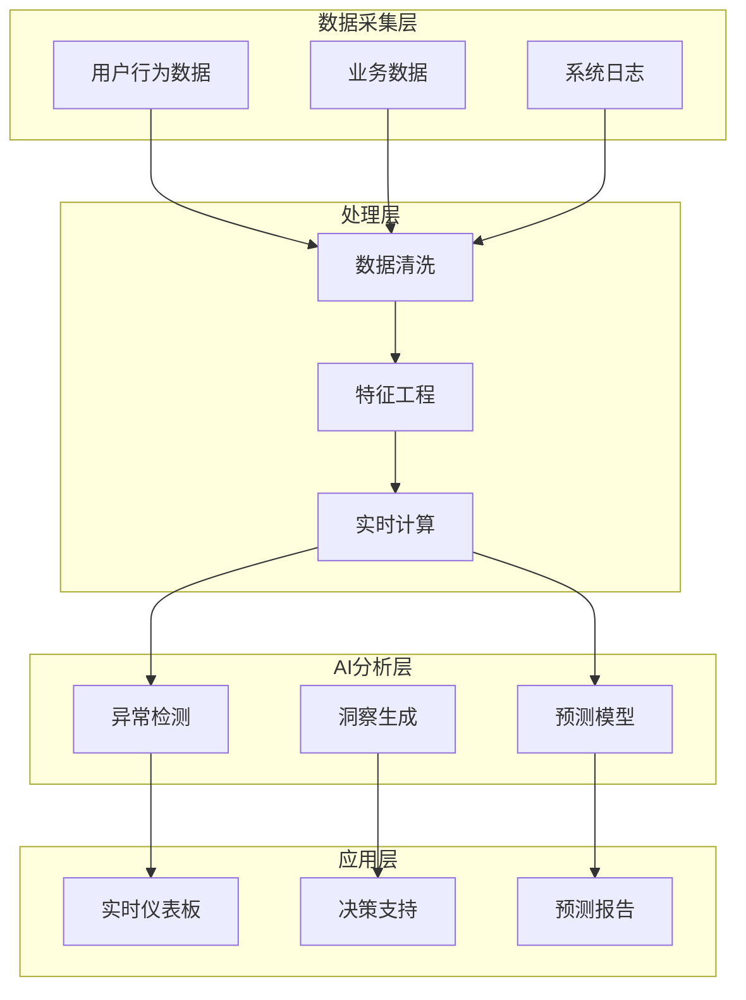
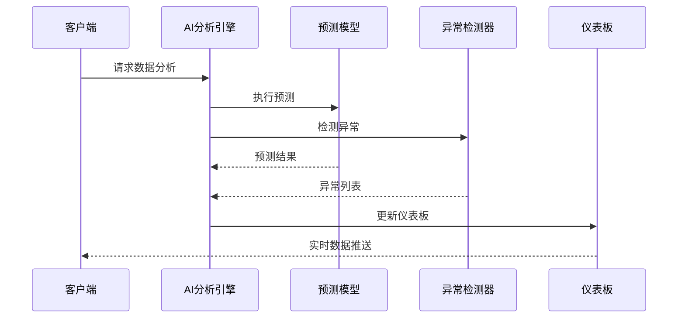

# Analytics 模块设计文档

> **文档类型**: 设计
> **所属模块**: Analytics (智能分析)
> **版本**: 1.0.0
> **创建日期**: 2026-01-03
> **最后更新**: 2026-01-03
> **维护人**: YYC³ Analytics Team

## 1. 模块概述

### 1.1 功能简介

Analytics 模块是 YYC³-MANA 的核心智能分析引擎，提供：

- 📊 **实时数据分析** - 实时处理和可视化业务数据
- 🤖 **AI驱动洞察** - 基于机器学习的智能预测
- 📈 **预测分析** - 趋势预测和异常检测
- 🎯 **决策支持** - 数据驱动的决策建议
- 📉 **异常检测** - 自动识别业务异常

### 1.2 核心组件

```
core/analytics/
├── AIAnalyticsEngine.ts       # AI分析引擎主类
├── AIDecisionSupport.ts       # AI决策支持系统
├── PredictiveAnalytics.ts     # 预测分析模块
├── AnomalyDetection.ts        # 异常检测模块
├── OmniChannelAnalytics.ts    # 全渠道分析
├── RealTimeAIDashboard.ts     # 实时AI仪表板
└── types.ts                   # 类型定义
```

## 2. 架构设计

### 2.1 系统架构



### 2.2 数据流

```typescript
// 数据流示例
interface AnalyticsDataFlow {
  // 1. 数据采集
  collection: {
    source: 'user_behavior' | 'business' | 'system';
    timestamp: Date;
    data: JsonObject;
  };

  // 2. 数据处理
  processing: {
    cleaning: (data: RawData) => CleanData;
    featureEngineering: (data: CleanData) => Features;
    realTimeComputation: (features: Features) => Metrics;
  };

  // 3. AI分析
  analysis: {
    prediction: PredictiveModel;
    anomalyDetection: AnomalyDetector;
    insightGeneration: InsightGenerator;
  };

  // 4. 结果应用
  application: {
    dashboard: RealTimeDashboard;
    decisionSupport: DecisionSupport;
    reporting: PredictionReport;
  };
}
```

## 3. 核心组件设计

### 3.1 AIAnalyticsEngine

**职责**: 核心分析引擎，协调各个分析组件

```typescript
export class AIAnalyticsEngine {
  private _predictiveModel: PredictiveModel;
  private _anomalyDetector: AnomalyDetector;
  private _insightGenerator: InsightGenerator;

  /**
   * 生成商业智能报告
   */
  async generateBusinessIntelligence(): Promise<BusinessIntelligence> {
    const rawData = await this.collectAllData();
    const processedData = await this.enrichWithAIFeatures(rawData);

    return {
      predictions: await this.generatePredictions(processedData),
      anomalies: await this.detectAnomalies(processedData),
      insights: await this.generateAIInsights(processedData),
      recommendations: await this.generateOptimizationRecommendations(processedData),
      visualization: await this.createAIVisualizations(processedData)
    };
  }
}
```

**关键方法**:
- `collectAllData()` - 数据采集
- `enrichWithAIFeatures()` - AI特征增强
- `generatePredictions()` - 预测生成
- `detectAnomalies()` - 异常检测
- `generateAIInsights()` - AI洞察生成

### 3.2 AIDecisionSupport

**职责**: AI驱动的决策支持系统

```typescript
export class AIDecisionSupport {
  /**
   * 生成智能推荐
   */
  async generateIntelligentRecommendations(
    context: BusinessContext
  ): Promise<IntelligentRecommendations> {
    return {
      strategies: await this.analyzeStrategies(context),
      scenarios: await this.simulateScenarios(context),
      risks: await this.assessRisks(context),
      opportunities: await this.identifyOpportunities(context),
      actionPlans: await this.generateActionPlans(context)
    };
  }
}
```

**决策维度**:
- 策略分析 - 战略选项评估
- 场景模拟 - 假设场景分析
- 风险评估 - 风险识别和量化
- 机会识别 - 机会发现和排序
- 行动计划 - 可执行建议

### 3.3 PredictiveAnalytics

**职责**: 预测分析引擎

```typescript
export class PredictiveAnalytics {
  /**
   * 时间序列预测
   */
  async forecast(
    metric: string,
    horizon: number
  ): Promise<BusinessForecast> {
    const patterns = await this.recognizePatterns(metric);
    const seasonality = await this.analyzeSeasonality(metric);
    const scenarios = await this.simulateScenarios(metric, horizon);

    return {
      forecast: this.calculateForecast(patterns, seasonality),
      confidence: this.assessConfidence(patterns),
      scenarios: scenarios,
      recommendations: this.generateRecommendations(scenarios)
    };
  }
}
```

**预测类型**:
- 需求预测 - 业务量预测
- 流失预测 - 客户流失预警
- 收入预测 - 营收预测
- 趋势预测 - 长期趋势

### 3.4 AnomalyDetection

**职责**: 异常检测引擎

```typescript
export class AnomalyDetection {
  /**
   * 实时异常检测
   */
  async detectRealTimeAnomalies(
    dataStream: DataStream
  ): Promise<Anomaly[]> {
    const baseline = await this.establishBaseline(dataStream);
    const outliers = await this.identifyOutliers(dataStream, baseline);
    const patterns = await this.analyzePatterns(outliers);

    return this.classifyAnomalies(patterns);
  }
}
```

**检测方法**:
- 统计方法 - 基于统计学的异常检测
- 机器学习 - 基于ML的异常识别
- 时间序列 - 时间序列异常检测
- 实时检测 - 流数据实时监控

### 3.5 RealTimeAIDashboard

**职责**: 实时AI仪表板

```typescript
export class RealTimeAIDashboard {
  /**
   * 实时数据更新
   */
  async updateRealTimeData(): Promise<DashboardData> {
    return {
      metrics: await this.streamMetrics(),
      alerts: await this.streamAlerts(),
      insights: await this.streamInsights(),
      predictions: await this.streamPredictions()
    };
  }
}
```

**仪表板组件**:
- 实时指标 - KPI实时监控
- 智能告警 - 异常自动告警
- AI洞察 - 实时AI分析
- 预测展示 - 预测结果可视化

## 4. 数据模型

### 4.1 核心类型定义

```typescript
// 预测模型
export interface PredictiveModel {
  modelId: string;
  version: string;
  accuracy: number;
  lastTrained: Date;
}

// 异常检测器
export interface AnomalyDetector {
  threshold: number;
  sensitivity: 'low' | 'medium' | 'high';
}

// 洞察生成器
export interface InsightGenerator {
  enabled: boolean;
  confidenceThreshold: number;
}

// 商业智能
export interface BusinessIntelligence {
  predictions: PredictionResult[];
  anomalies: Anomaly[];
  insights: AnalyticsInsight[];
  recommendations: OptimizationRecommendation[];
  visualization: AIVisualization;
}

// 性能指标
export interface PerformanceMetric {
  responseTime: number;
  relevance: number;
  usefulness: number;
  userSatisfaction: number;
  timestamp?: Timestamp;
}
```

### 4.2 数据流转



## 5. API接口

### 5.1 REST API

```typescript
// GET /api/analytics/dashboard
// 获取仪表板数据
interface DashboardResponse {
  metrics: PerformanceMetric[];
  insights: AnalyticsInsight[];
  alerts: Alert[];
  predictions: Prediction[];
}

// POST /api/analytics/predict
// 执行预测分析
interface PredictRequest {
  metric: string;
  horizon: number;  // 预测时间范围
  confidence: number;
}

interface PredictResponse {
  forecast: Forecast[];
  confidence: number;
  scenarios: Scenario[];
}
```

### 5.2 WebSocket API

```typescript
// 实时数据推送
ws://localhost:3000/api/analytics/stream

// 消息格式
interface StreamMessage {
  type: 'metric' | 'insight' | 'alert' | 'prediction';
  data: any;
  timestamp: Date;
}
```

## 6. 性能优化

### 6.1 缓存策略

```typescript
// Redis缓存
interface CacheStrategy {
  metrics: { ttl: 60 };  // 指标缓存60秒
  insights: { ttl: 300 }; // 洞察缓存5分钟
  predictions: { ttl: 600 }; // 预测缓存10分钟
}
```

### 6.2 流式处理

```typescript
// 实时流处理
async function* streamMetrics(): AsyncGenerator<Metric> {
  while (true) {
    const metric = await collectMetric();
    yield metric;
    await delay(1000); // 每秒采样
  }
}
```

### 6.3 批量处理

```typescript
// 批量分析
async function batchAnalyze(data: Data[]): Promise<Result[]> {
  const batchSize = 100;
  const results = [];

  for (let i = 0; i < data.length; i += batchSize) {
    const batch = data.slice(i, i + batchSize);
    const batchResults = await Promise.all(
      batch.map(item => analyze(item))
    );
    results.push(...batchResults);
  }

  return results;
}
```

## 7. 使用示例

### 7.1 基础使用

```typescript
// 初始化分析引擎
const engine = new AIAnalyticsEngine();
await engine.initialize();

// 生成商业智能报告
const bi = await engine.generateBusinessIntelligence();
console.log('预测:', bi.predictions);
console.log('异常:', bi.anomalies);
console.log('洞察:', bi.insights);
```

### 7.2 决策支持

```typescript
// AI决策支持
const decisionSupport = new AIDecisionSupport();
const recommendations = await decisionSupport.generateIntelligentRecommendations({
  businessGoal: 'increase_revenue',
  timeframe: 'quarter',
  constraints: { budget: 100000 }
});

// 应用建议
recommendations.actionPlans.forEach(plan => {
  console.log(`优先级: ${plan.priority}`);
  console.log(`行动: ${plan.action}`);
  console.log(`预期收益: ${plan.expectedImpact}`);
});
```

### 7.3 实时监控

```typescript
// 实时仪表板
const dashboard = new RealTimeAIDashboard();

// WebSocket连接
const ws = new WebSocket('ws://localhost:3000/api/analytics/stream');

ws.onmessage = (event) => {
  const message: StreamMessage = JSON.parse(event.data);

  switch (message.type) {
    case 'metric':
      updateMetricUI(message.data);
      break;
    case 'alert':
      showAlert(message.data);
      break;
    case 'insight':
      addInsight(message.data);
      break;
  }
};
```

## 8. 测试

### 8.1 单元测试

```typescript
describe('AIAnalyticsEngine', () => {
  it('should generate business intelligence', async () => {
    const engine = new AIAnalyticsEngine();
    const bi = await engine.generateBusinessIntelligence();

    expect(bi.predictions).toBeDefined();
    expect(bi.anomalies).toBeDefined();
    expect(bi.insights).toBeDefined();
  });
});
```

### 8.2 集成测试

```typescript
describe('Analytics Integration', () => {
  it('should process end-to-end analytics', async () => {
    // 1. 数据采集
    const data = await collectTestData();

    // 2. AI分析
    const engine = new AIAnalyticsEngine();
    const result = await engine.analyze(data);

    // 3. 验证结果
    expect(result.insights.length).toBeGreaterThan(0);
    expect(result.confidence).toBeGreaterThan(0.8);
  });
});
```

## 9. 部署

### 9.1 环境变量

```bash
# .env.local
ANALYTICS_API_KEY=your_api_key
ANALYTICS_MODEL=gpt-4
ANALYTICS_CACHE_ENABLED=true
ANALYTICS_STREAM_ENABLED=true
```

### 9.2 Docker配置

```dockerfile
# Dockerfile
FROM oven/bun:1 AS base
WORKDIR /app

# 安装依赖
COPY package.json bun.lockb ./
RUN bun install --frozen-lockfile

# 复制源码
COPY . .

# 构建
RUN bun run build

# 生产镜像
FROM oven/bun:1 AS production
COPY --from=base /app/public ./public
COPY --from=base /app/.next/standalone ./
EXPOSE 3000
CMD ["bun", "run", "start"]
```

## 附录

### A. 相关文档

- [01-核心-架构-系统架构概览.md](../01-核心-架构-系统架构概览.md)
- [02-Analytics-实施-分析引擎实施指南.md](./02-Analytics-实施-分析引擎实施指南.md)

### B. API文档

详见 [API文档](../99-附录-API文档.md)

### C. 变更记录

| 版本 | 日期 | 作者 | 变更内容 |
|------|------|------|----------|
| 1.0.0 | 2026-01-03 | YYC³ | 初始版本 |

---

**模块维护**: YYC³ Analytics Team
**联系方式**: admin@0379.email
