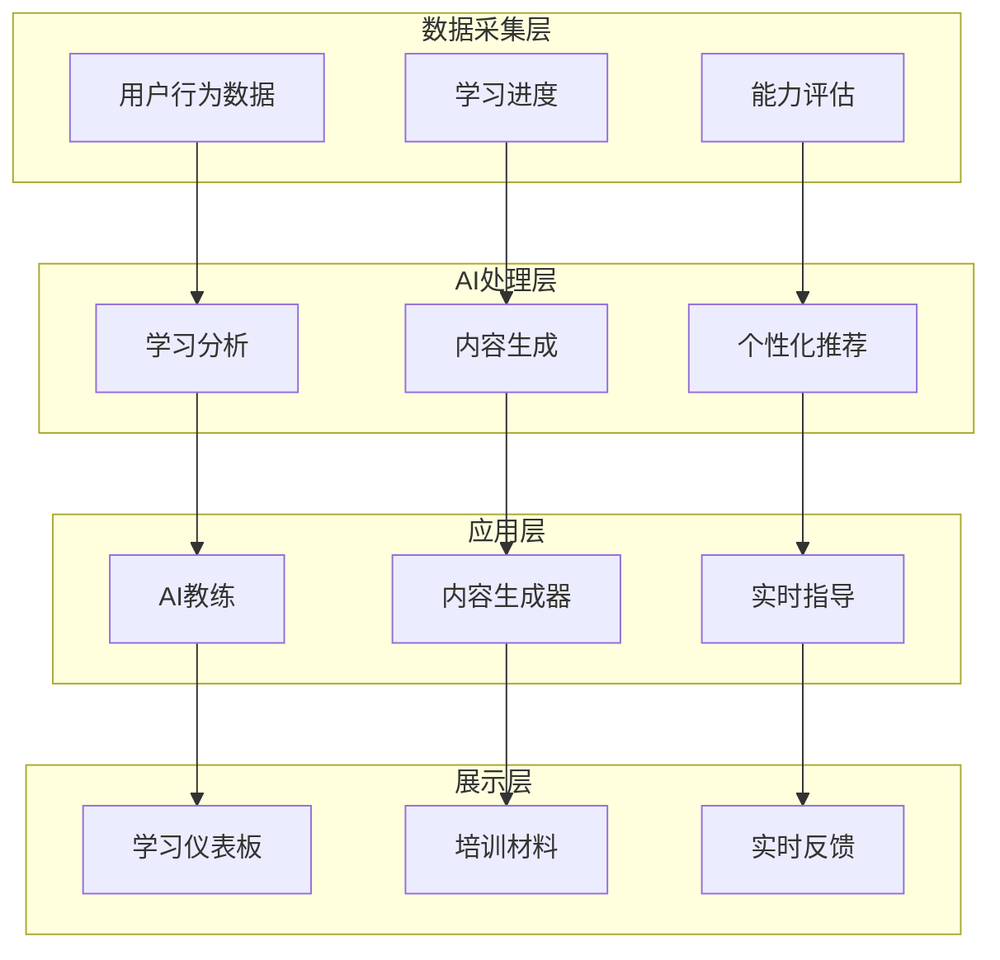

# Education 模块设计文档

> **文档类型**: 设计
> **所属模块**: Education (教育培训)
> **版本**: 1.0.0
> **创建日期**: 2026-01-03
> **最后更新**: 2026-01-03
> **维护人**: YYC³ Education Team

## 1. 模块概述

### 1.1 功能简介

Education 模块是 YYC³-MANA 的智能教育培训系统，提供：

- 🤖 **AI教练系统** - 智能化个人学习指导
- 📚 **智能内容生成** - 自动生成培训材料
- 🎯 **个性化学习** - 根据用户特点定制学习路径
- 💡 **实时指导** - 实时反馈和建议
- 📊 **技能评估** - 全面的能力评估体系

### 1.2 核心组件

```
core/education/
├── AICoachingSystem.ts          # AI教练系统
├── IntelligentContentGenerator.ts  # 智能内容生成器
├── PersonalizedLearning.ts      # 个性化学习
├── RealTimeCoaching.ts          # 实时指导
└── types.ts                     # 类型定义
```

## 2. 架构设计

### 2.1 系统架构



### 2.2 数据流

```typescript
interface EducationDataFlow {
  // 1. 学习数据采集
  collection: {
    userBehavior: UserBehavior;
    learningProgress: LearningProgress;
    skillAssessment: SkillAssessment;
  };

  // 2. AI分析处理
  processing: {
    learningAnalysis: LearningAnalysis;
    contentGeneration: ContentGeneration;
    personalization: Personalization;
  };

  // 3. 教练指导
  coaching: {
    aiCoach: AICoach;
    contentRecommendation: ContentRecommendation;
    realTimeFeedback: RealTimeFeedback;
  };
}
```

## 3. 核心组件设计

### 3.1 AICoachingSystem

**职责**: AI教练系统核心

```typescript
export class AICoachingSystem {
  private _learnerProfile: LearnerProfile;
  private _coachingStrategy: CoachingStrategy;

  /**
   * 提供智能指导
   */
  async provideIntelligentGuidance(
    context: LearningContext
  ): Promise<IntelligentGuidance> {
    const learnerState = await this.analyzeLearnerState(context);
    const learningPath = await this.generateLearningPath(learnerState);
    const recommendations = await this.generateRecommendations(learnerState);

    return {
      guidance: await this.generateGuidance(learnerState),
      learningPath,
      recommendations,
      feedback: await this.generateFeedback(learnerState)
    };
  }

  /**
   * 评估学习效果
   */
  async assessLearningEffectiveness(
    session: LearningSession
  ): Promise<LearningEffectiveness> {
    return {
      skillImprovement: await this.measureSkillImprovement(session),
      knowledgeRetention: await this.measureKnowledgeRetention(session),
      engagementLevel: await this.measureEngagement(session),
      areasForImprovement: await this.identifyImprovementAreas(session)
    };
  }
}
```

**核心功能**:
- 智能指导生成
- 学习路径规划
- 学习效果评估
- 个性化推荐

### 3.2 IntelligentContentGenerator

**职责**: 智能培训内容生成

```typescript
export class IntelligentContentGenerator {
  /**
   * 生成培训材料
   */
  async generateTrainingMaterial(
    topic: string,
    targetAudience: LearnerProfile
  ): Promise<TrainingMaterial> {
    const outline = await this.generateOutline(topic, targetAudience);
    const modules = await this.generateModules(outline);
    const assessments = await this.generateAssessments(modules);
    const resources = await this.curateResources(topic);

    return {
      title: outline.title,
      modules,
      assessments,
      resources,
      difficulty: this.assessDifficulty(targetAudience),
      estimatedDuration: this.estimateDuration(modules)
    };
  }

  /**
   * 适应不同学习风格
   */
  async adaptToLearningStyle(
    content: TrainingMaterial,
    learningStyle: LearningStyle
  ): Promise<TrainingMaterial> {
    const adaptedContent = { ...content };

    switch (learningStyle) {
      case 'visual':
        adaptedContent.modules = await this.enhanceWithVisuals(content.modules);
        break;
      case 'auditory':
        adaptedContent.modules = await this.enhanceWithAudio(content.modules);
        break;
      case 'kinesthetic':
        adaptedContent.modules = await this.enhanceWithActivities(content.modules);
        break;
    }

    return adaptedContent;
  }
}
```

**内容类型**:
- 培训模块
- 评估测验
- 学习资源
- 多媒体内容

### 3.3 PersonalizedLearning

**职责**: 个性化学习引擎

```typescript
export class PersonalizedLearning {
  /**
   * 创建个性化学习路径
   */
  async createPersonalizedPath(
    learner: LearnerProfile,
    goals: LearningGoals
  ): Promise<LearningPath> {
    const currentSkills = await this.assessCurrentSkills(learner);
    const skillGaps = await this.identifySkillGaps(currentSkills, goals);
    const learningObjectives = await this.defineObjectives(skillGaps);
    const sequence = await this.optimizeSequence(learningObjectives, learner);

    return {
      objectives: learningObjectives,
      sequence,
      milestones: await this.defineMilestones(sequence),
      estimatedCompletion: this.estimateCompletion(sequence),
      adaptivePlan: await this.createAdaptivePlan(learner)
    };
  }

  /**
   * 自适应学习调整
   */
  async adaptLearningPath(
    path: LearningPath,
    performance: PerformanceData
  ): Promise<LearningPath> {
    const adjustments = await this.analyzePerformance(performance);

    if (adjustments.difficultyAdjustment !== 0) {
      path = await this.adjustDifficulty(path, adjustments.difficultyAdjustment);
    }

    if (adjustments.paceChange !== 0) {
      path = await this.adjustPace(path, adjustments.paceChange);
    }

    if (adjustments.recommendedTopics.length > 0) {
      path = await this.insertTopics(path, adjustments.recommendedTopics);
    }

    return path;
  }
}
```

**个性化维度**:
- 技能水平评估
- 学习速度调整
- 内容难度适配
- 学习风格匹配

### 3.4 RealTimeCoaching

**职责**: 实时学习指导

```typescript
export class RealTimeCoaching {
  /**
   * 实时反馈
   */
  async provideRealTimeFeedback(
    activity: LearningActivity
  ): Promise<RealTimeFeedback> {
    const performance = await this.monitorPerformance(activity);
    const issues = await this.detectIssues(performance);
    const suggestions = await this.generateSuggestions(issues);

    return {
      immediate: suggestions.immediate,
      encouraging: this.generateEncouragement(performance),
      corrective: suggestions.corrective,
      metrics: performance
    };
  }

  /**
   * 互动式问答
   */
  async handleInteractiveQA(
    question: string,
    context: LearningContext
  ): Promise<QAResponse> {
    const answer = await this.generateAnswer(question, context);
    const relatedConcepts = await this.findRelatedConcepts(question);
    const practiceExercises = await this.recommendPractice(question);

    return {
      answer,
      relatedConcepts,
      practiceExercises,
      confidence: this.assessConfidence(answer)
    };
  }
}
```

## 4. 数据模型

### 4.1 核心类型定义

```typescript
// 学习者画像
export interface LearnerProfile {
  id: string;
  name: string;
  currentLevel: Level;
  learningStyle: LearningStyle;
  preferences: LearningPreferences;
  progress: LearningProgress;
}

// 学习路径
export interface LearningPath {
  id: string;
  objectives: LearningObjective[];
  sequence: LearningModule[];
  milestones: Milestone[];
  estimatedCompletion: Date;
  adaptivePlan: AdaptivePlan;
}

// 培训材料
export interface TrainingMaterial {
  id: string;
  title: string;
  modules: LearningModule[];
  assessments: Assessment[];
  resources: Resource[];
  difficulty: Difficulty;
  estimatedDuration: Duration;
}

// 学习会话
export interface LearningSession {
  id: string;
  learnerId: string;
  startTime: Date;
  endTime?: Date;
  activities: LearningActivity[];
  performance: PerformanceData;
  feedback: Feedback;
}
```

### 4.2 性能指标

```typescript
export interface PerformanceMetric {
  name: string;
  value: number;
  target: number;
  status: 'on_track' | 'needs_attention' | 'critical';
  timestamp?: Timestamp;
}

export interface LearningEffectiveness {
  skillImprovement: number;
  knowledgeRetention: number;
  engagementLevel: number;
  areasForImprovement: string[];
}
```

## 5. API接口

### 5.1 REST API

```typescript
// GET /api/education/coaching/guidance
// 获取AI教练指导
interface GuidanceResponse {
  guidance: string;
  learningPath: LearningPath;
  recommendations: Recommendation[];
}

// POST /api/education/content/generate
// 生成培训内容
interface GenerateContentRequest {
  topic: string;
  targetAudience: LearnerProfile;
  format: 'video' | 'text' | 'interactive';
}

interface GenerateContentResponse {
  material: TrainingMaterial;
  estimatedDuration: Duration;
}

// POST /api/education/path/create
// 创建个性化学习路径
interface CreatePathRequest {
  learnerId: string;
  goals: LearningGoals;
  timeline: Duration;
}

interface CreatePathResponse {
  path: LearningPath;
  milestones: Milestone[];
}
```

### 5.2 WebSocket API

```typescript
// 实时学习指导
ws://localhost:3000/api/education/coaching/stream

// 消息格式
interface CoachingMessage {
  type: 'feedback' | 'suggestion' | 'encouragement';
  content: string;
  timestamp: Date;
}
```

## 6. 使用示例

### 6.1 初始化AI教练

```typescript
// 创建AI教练系统
const coachingSystem = new AICoachingSystem();
await coachingSystem.initialize();

// 提供智能指导
const guidance = await coachingSystem.provideIntelligentGuidance({
  learnerId: 'learner123',
  currentTopic: 'data_analysis',
  learningGoal: 'master_advanced_skills'
});

console.log('学习建议:', guidance.guidance);
console.log('推荐路径:', guidance.learningPath);
```

### 6.2 生成培训内容

```typescript
// 智能内容生成
const contentGenerator = new IntelligentContentGenerator();

const material = await contentGenerator.generateTrainingMaterial(
  'TypeScript高级特性',
  {
    level: 'intermediate',
    learningStyle: 'visual',
    goals: ['master_generics', 'understand_decorators']
  }
);

console.log('培训模块:', material.modules);
console.log('评估测验:', material.assessments);
```

### 6.3 实时学习指导

```typescript
// 实时指导
const realTimeCoach = new RealTimeCoaching();

// WebSocket连接
const ws = new WebSocket('ws://localhost:3000/api/education/coaching/stream');

ws.onmessage = async (event) => {
  const message: CoachingMessage = JSON.parse(event.data);

  switch (message.type) {
    case 'feedback':
      displayFeedback(message.content);
      break;
    case 'suggestion':
      showSuggestion(message.content);
      break;
    case 'encouragement':
      showEncouragement(message.content);
      break;
  }
};
```

## 7. 学习效果评估

### 7.1 评估维度

- **技能提升** - 学习前后技能对比
- **知识保留** - 长期记忆保持率
- **参与度** - 学习活动和互动频率
- **完成率** - 课程和模块完成情况

### 7.2 持续优化

```typescript
// 学习分析
class LearningAnalytics {
  async analyzeLearningPatterns(
    sessions: LearningSession[]
  ): Promise<LearningPatterns> {
    return {
      peakLearningTimes: this.identifyPeakTimes(sessions),
      optimalSessionLength: this.calculateOptimalLength(sessions),
      preferredContentTypes: this.analyzePreferences(sessions),
      difficultyProgression: this.analyzeProgression(sessions)
    };
  }

  async recommendOptimizations(
    patterns: LearningPatterns
  ): Promise<OptimizationRecommendation[]> {
    return [
      this.scheduleOptimization(patterns),
      this.contentOptimization(patterns),
      this.methodologyOptimization(patterns)
    ];
  }
}
```

## 8. 最佳实践

### 8.1 内容设计

- ✅ **清晰结构** - 模块化内容组织
- ✅ **多媒体结合** - 视频、文本、互动练习
- ✅ **难度递进** - 从简单到复杂
- ✅ **实践导向** - 理论结合实际
- ✅ **定期更新** - 保持内容时效性

### 8.2 学习指导

- ✅ **个性化** - 根据学习者特点定制
- ✅ **及时反馈** - 实时响应和指导
- ✅ **正向激励** - 鼓励和认可进步
- ✅ **灵活调整** - 根据表现动态调整
- ✅ **长期跟踪** - 持续关注学习效果

## 附录

### A. 相关文档

- [01-核心-架构-系统架构概览.md](../01-核心-架构-系统架构概览.md)
- [20-Analytics-设计-AI分析引擎设计.md](../20-Analytics-设计-AI分析引擎设计.md)

### B. 变更记录

| 版本 | 日期 | 作者 | 变更内容 |
|------|------|------|----------|
| 1.0.0 | 2026-01-03 | YYC³ | 初始版本 |

---

**模块维护**: YYC³ Education Team
**联系方式**: admin@0379.email
