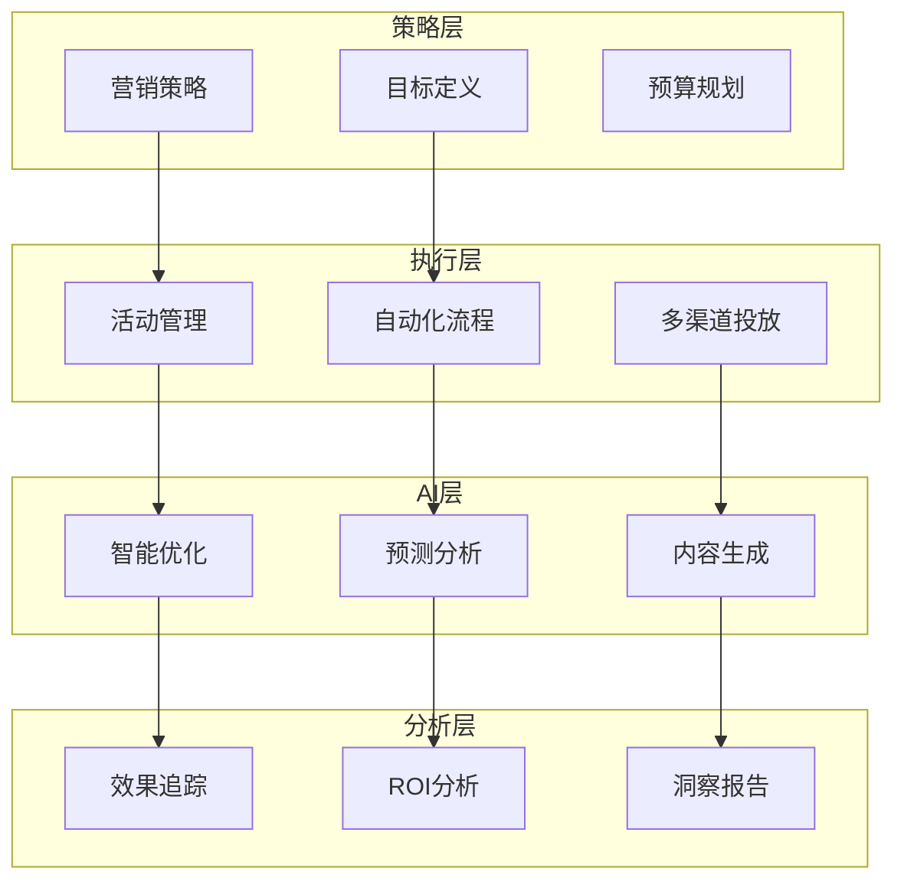

# Marketing 模块设计文档

> **文档类型**: 设计
> **所属模块**: Marketing (营销自动化)
> **版本**: 1.0.0
> **创建日期**: 2026-01-03
> **最后更新**: 2026-01-03
> **维护人**: YYC³ Marketing Team

## 1. 模块概述

### 1.1 功能简介

Marketing 模块是 YYC³-MANA 的智能营销自动化系统，提供：

- 🎯 **AI活动管理** - 智能化的营销活动策划与执行
- 🤖 **高级自动化** - 基于规则的自动化营销流程
- 📱 **移动工作台** - 移动端营销管理与监控
- 📊 **营销分析** - 全方位的营销数据分析
- 🔄 **客户旅程** - 端到端的客户旅程管理

### 1.2 核心组件

```
core/marketing/
├── AICampaignManager.ts      # AI活动管理器
├── AdvancedAutomation.ts     # 高级自动化引擎
├── AIMobileWorkbench.ts      # AI移动工作台
└── types.ts                  # 类型定义
```

## 2. 架构设计

### 2.1 系统架构



### 2.2 数据流

```typescript
interface MarketingDataFlow {
  // 1. 策略制定
  strategy: {
    goals: MarketingGoals;
    targetAudience: TargetAudience;
    budget: Budget;
    timeline: Timeline;
  };

  // 2. 活动执行
  execution: {
    campaigns: Campaign[];
    automation: AutomationFlow[];
    channels: Channel[];
  };

  // 3. AI优化
  ai: {
    optimization: AIOptimization;
    prediction: Prediction;
    contentGeneration: ContentGeneration;
  };

  // 4. 效果分析
  analytics: {
    metrics: MarketingMetrics;
    roi: ROIAnalysis;
    insights: MarketingInsights;
  };
}
```

## 3. 核心组件设计

### 3.1 AICampaignManager

**职责**: AI驱动的营销活动管理

```typescript
export class AICampaignManager {
  private _aiModel: AIModel;
  private _analytics: AnalyticsEngine;

  /**
   * 创建智能营销活动
   */
  async createIntelligentCampaign(
    brief: CampaignBrief
  ): Promise<MarketingCampaign> {
    // 1. AI分析目标受众
    const audience = await this.analyzeAudience(brief.targetAudience);

    // 2. 生成营销策略
    const strategy = await this.generateStrategy(brief, audience);

    // 3. 创建内容方案
    const content = await this.generateContent(strategy);

    // 4. 规划投放渠道
    const channels = await this.planChannels(strategy, audience);

    // 5. 预测效果
    const prediction = await this.predictPerformance({
      strategy,
      content,
      channels
    });

    return {
      id: generateId(),
      name: brief.name,
      strategy,
      content,
      channels,
      budget: brief.budget,
      timeline: brief.timeline,
      predictedROI: prediction.roi,
      status: 'draft'
    };
  }

  /**
   * 优化活动表现
   */
  async optimizeCampaign(
    campaign: MarketingCampaign,
    performance: CampaignPerformance
  ): Promise<MarketingCampaign> {
    // AI分析表现数据
    const insights = await this.analyzePerformance(performance);

    // 生成优化建议
    const optimizations = await this.generateOptimizations(insights);

    // 应用优化
    if (optimizations.content) {
      campaign.content = await this.optimizeContent(campaign.content, optimizations.content);
    }

    if (optimizations.targeting) {
      campaign.targeting = await this.optimizeTargeting(campaign.targeting, optimizations.targeting);
    }

    if (optimizations.budget) {
      campaign.budget = await this.reallocateBudget(campaign.budget, optimizations.budget);
    }

    return campaign;
  }

  /**
   * A/B测试管理
   */
  async manageABTest(
    campaign: MarketingCampaign,
    variants: CampaignVariant[]
  ): Promise<ABTestResult> {
    // 执行测试
    const results = await Promise.all(
      variants.map(async variant => ({
        variant,
        metrics: await this.measureVariantPerformance(variant)
      }))
    );

    // 统计分析
    const winner = await this.determineWinner(results);
    const significance = await this.calculateSignificance(results);

    return {
      winner: winner.variant,
      confidence: significance,
      improvements: await this.calculateImprovements(winner, results),
      recommendation: await this.generateRecommendation(results)
    };
  }
}
```

**核心功能**:
- 智能活动创建
- 实时优化调整
- A/B测试管理
- 效果预测分析

### 3.2 AdvancedAutomation

**职责**: 高级自动化引擎

```typescript
export class AdvancedAutomation {
  /**
   * 创建自动化流程
   */
  async createAutomationFlow(
    definition: AutomationDefinition
  ): Promise<AutomationFlow> {
    const triggers = await this.defineTriggers(definition);
    const actions = await this.defineActions(definition);
    const conditions = await this.defineConditions(definition);

    return {
      id: generateId(),
      name: definition.name,
      triggers,
      actions,
      conditions,
      status: 'active'
    };
  }

  /**
   * 执行自动化流程
   */
  async executeAutomation(
    flow: AutomationFlow,
    context: AutomationContext
  ): Promise<AutomationExecution> {
    // 检查触发条件
    const shouldTrigger = await this.checkTriggers(flow.triggers, context);

    if (!shouldTrigger) {
      return { status: 'skipped', reason: 'trigger_not_met' };
    }

    // 评估条件
    const conditionMet = await this.evaluateConditions(flow.conditions, context);

    if (!conditionMet) {
      return { status: 'skipped', reason: 'condition_not_met' };
    }

    // 执行动作
    const results = await Promise.all(
      flow.actions.map(action => this.executeAction(action, context))
    );

    return {
      status: 'completed',
      results,
      timestamp: new Date()
    };
  }

  /**
   * 智能触发器
   */
  async createSmartTrigger(
    eventType: string,
    aiConfig: AIConfig
  ): Promise<SmartTrigger> {
    return {
      eventType,
      aiEnabled: true,
      mlModel: aiConfig.model,
      threshold: aiConfig.threshold,
      adaptive: true,
      behavior: await this.trainTriggerBehavior(eventType, aiConfig)
    };
  }

  /**
   * 个性化自动化
   */
  async personalizeAutomation(
    flow: AutomationFlow,
    customer: Customer
  ): Promise<AutomationFlow> {
    const preferences = await this.getPreferences(customer);
    const behavior = await this.analyzeBehavior(customer);

    // 个性化触发时机
    flow.triggers = flow.triggers.map(trigger => ({
      ...trigger,
      timing: this.optimalTiming(preferences, behavior)
    }));

    // 个性化内容
    flow.actions = flow.actions.map(action => ({
      ...action,
      content: this.personalizeContent(action.content, customer)
    }));

    return flow;
  }
}
```

**自动化特性**:
- 事件触发机制
- 条件分支逻辑
- 多动作编排
- 个性化适配

### 3.3 AIMobileWorkbench

**职责**: AI移动工作台

```typescript
export class AIMobileWorkbench {
  /**
   * 移动端活动监控
   */
  async monitorCampaigns(
    user: User
  ): Promise<MobileDashboard> {
    const campaigns = await this.getUserCampaigns(user);
    const alerts = await this.generateAlerts(campaigns);
    const quickActions = await this.suggestActions(campaigns);

    return {
      campaigns: campaigns.map(c => ({
        id: c.id,
        name: c.name,
        status: c.status,
        keyMetrics: this.extractKeyMetrics(c),
        trends: await this.getTrends(c)
      })),
      alerts,
      quickActions,
      insights: await this.generateInsights(campaigns)
    };
  }

  /**
   * 快速操作
   */
  async quickAction(
    action: QuickAction,
    context: ActionContext
  ): Promise<ActionResult> {
    switch (action.type) {
      case 'pause_campaign':
        return await this.pauseCampaign(context.campaignId);
      case 'adjust_budget':
        return await this.adjustBudget(context.campaignId, action.params);
      case 'update_audience':
        return await this.updateAudience(context.campaignId, action.params);
      case 'generate_content':
        return await this.generateContent(action.params);
      default:
        throw new Error(`Unknown action type: ${action.type}`);
    }
  }

  /**
   * AI助手
   */
  async aiAssistant(
    query: string,
    context: AssistantContext
  ): Promise<AssistantResponse> {
    // 理解用户意图
    const intent = await this.understandIntent(query);

    // 检索相关信息
    const information = await this.retrieveInformation(intent, context);

    // 生成响应
    const response = await this.generateResponse(query, information);

    return {
      answer: response.text,
      suggestions: response.suggestions,
      actions: response.recommendedActions,
      confidence: response.confidence
    };
  }

  /**
   * 实时通知
   */
  async pushNotification(
    event: MarketingEvent,
    user: User
  ): Promise<Notification> {
    const priority = await this.assessPriority(event);
    const message = await this.generateMessage(event);
    const actions = await this.suggestActions(event);

    return {
      type: event.type,
      priority,
      title: message.title,
      body: message.body,
      actions,
      timestamp: new Date()
    };
  }
}
```

**移动端功能**:
- 活动实时监控
- 快速操作执行
- AI智能助手
- 实时消息推送

## 4. 数据模型

### 4.1 核心类型定义

```typescript
// 营销活动
export interface MarketingCampaign {
  id: string;
  name: string;
  strategy: MarketingStrategy;
  content: CampaignContent;
  channels: Channel[];
  budget: Budget;
  timeline: Timeline;
  predictedROI: number;
  actualROI?: number;
  status: CampaignStatus;
}

// 自动化流程
export interface AutomationFlow {
  id: string;
  name: string;
  triggers: Trigger[];
  actions: Action[];
  conditions: Condition[];
  status: 'active' | 'paused' | 'archived';
}

// 客户旅程
export interface CustomerJourney {
  customerId: string;
  stages: JourneyStage[];
  touchpoints: Touchpoint[];
  conversions: Conversion[];
  metrics: JourneyMetrics;
}
```

### 4.2 性能指标

```typescript
export interface MarketingMetrics {
  impressions: number;
  clicks: number;
  clickThroughRate: number;
  conversions: number;
  conversionRate: number;
  costPerAcquisition: number;
  returnOnAdSpend: number;
  customerLifetimeValue: number;
}
```

## 5. API接口

### 5.1 REST API

```typescript
// POST /api/marketing/campaigns/create
// 创建营销活动
interface CreateCampaignRequest {
  name: string;
  goals: MarketingGoals;
  targetAudience: TargetAudience;
  budget: Budget;
  timeline: Timeline;
}

interface CreateCampaignResponse {
  campaign: MarketingCampaign;
  predictions: PerformancePrediction;
}

// POST /api/marketing/automation/create
// 创建自动化流程
interface CreateAutomationRequest {
  name: string;
  triggers: TriggerDefinition[];
  actions: ActionDefinition[];
  conditions: ConditionDefinition[];
}

// GET /api/marketing/analytics/dashboard
// 获取营销分析
interface DashboardResponse {
  metrics: MarketingMetrics;
  campaigns: CampaignSummary[];
  insights: Insight[];
  recommendations: Recommendation[];
}
```

### 5.2 WebSocket API

```typescript
// 实时营销数据
ws://localhost:3000/api/marketing/stream

// 消息格式
interface MarketingStreamMessage {
  type: 'campaign_update' | 'automation_trigger' | 'alert' | 'insight';
  data: any;
  timestamp: Date;
}
```

## 6. 使用示例

### 6.1 创建AI营销活动

```typescript
// 初始化活动管理器
const campaignManager = new AICampaignManager();

// 创建智能活动
const campaign = await campaignManager.createIntelligentCampaign({
  name: '春季促销活动',
  goals: ['increase_sales', 'acquire_customers'],
  targetAudience: {
    demographics: { age: [25, 45], interests: ['tech', 'lifestyle'] },
    behavior: { recentPurchases: true, engagement: 'high' }
  },
  budget: { amount: 50000, currency: 'CNY' },
  timeline: { start: new Date(), end: new Date(Date.now() + 30 * 24 * 60 * 60 * 1000) }
});

console.log('预测ROI:', campaign.predictedROI);
console.log('推荐渠道:', campaign.channels);
```

### 6.2 设置自动化流程

```typescript
// 自动化引擎
const automation = new AdvancedAutomation();

// 创建欢迎流程
const welcomeFlow = await automation.createAutomationFlow({
  name: '新客户欢迎流程',
  triggers: [
    { type: 'event', event: 'customer_signup' }
  ],
  actions: [
    { type: 'email', template: 'welcome_email', delay: 0 },
    { type: 'sms', template: 'welcome_offer', delay: 24 * 60 * 60 * 1000 },
    { type: 'push', template: 'app_tutorial', delay: 48 * 60 * 60 * 1000 }
  ],
  conditions: [
    { field: 'customer.type', operator: 'equals', value: 'new' }
  ]
});

// 执行自动化
await automation.executeAutomation(welcomeFlow, context);
```

### 6.3 移动工作台

```typescript
// 移动工作台
const workbench = new AIMobileWorkbench();

// 获取仪表板
const dashboard = await workbench.monitorCampaigns(user);

console.log('活动列表:', dashboard.campaigns);
console.log('告警信息:', dashboard.alerts);

// 快速操作
await workbench.quickAction({
  type: 'adjust_budget',
  params: { campaignId: 'xxx', amount: 10000 }
}, context);
```

## 7. 营销最佳实践

### 7.1 活动策划

- ✅ **明确目标** - 清晰的营销目标和KPI
- ✅ **精准定位** - 准确的目标受众画像
- ✅ **多渠道整合** - 协同的跨渠道策略
- ✅ **数据驱动** - 基于数据的决策优化
- ✅ **持续测试** - 不断的A/B测试和改进

### 7.2 自动化设计

- ✅ **客户中心** - 以客户体验为中心
- ✅ **适时适度** - 合理的触达频率
- ✅ **个性化** - 根据客户特点定制
- ✅ **闭环优化** - 持续的数据反馈优化
- ✅ **合规优先** - 遵守隐私和营销法规

### 7.3 移动端管理

- ✅ **实时监控** - 关键指标的实时追踪
- ✅ **快速响应** - 及时处理异常情况
- ✅ **智能决策** - AI辅助的快速决策
- ✅ **便捷操作** - 简化的操作流程
- ✅ **告警机制** - 及时的异常告警

## 8. 效果衡量

### 8.1 核心指标

- **曝光量** - 广告展示次数
- **点击率** - 点击/曝光比率
- **转化率** - 转化/点击比率
- **获客成本** - CPA/CAC
- **投资回报** - ROI/ROAS
- **客户价值** - LTV

### 8.2 归因分析

```typescript
// 多触点归因
class AttributionAnalyzer {
  async analyzeAttribution(
    customerJourney: CustomerJourney
  ): Promise<AttributionResult> {
    return {
      firstTouch: await this.firstTouchAttribution(customerJourney),
      lastTouch: await this.lastTouchAttribution(customerJourney),
      linear: await this.linearAttribution(customerJourney),
      timeDecay: await this.timeDecayAttribution(customerJourney),
      positionBased: await this.positionBasedAttribution(customerJourney)
    };
  }
}
```

## 附录

### A. 相关文档

- [01-核心-架构-系统架构概览.md](../01-核心-架构-系统架构概览.md)
- [20-Analytics-设计-AI分析引擎设计.md](../20-Analytics-设计-AI分析引擎设计.md)

### B. 变更记录

| 版本 | 日期 | 作者 | 变更内容 |
|------|------|------|----------|
| 1.0.0 | 2026-01-03 | YYC³ | 初始版本 |

---

**模块维护**: YYC³ Marketing Team
**联系方式**: admin@0379.email
