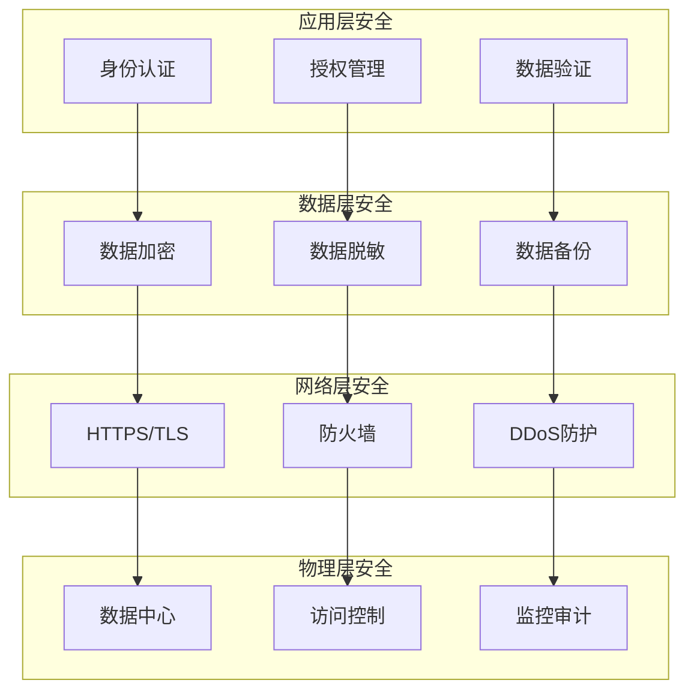

# Security 模块设计文档

> **文档类型**: 设计
> **所属模块**: Security (安全中心)
> **版本**: 1.0.0
> **创建日期**: 2026-01-03
> **最后更新**: 2026-01-03
> **维护人**: YYC³ Security Team

## 1. 模块概述

### 1.1 功能简介

Security 模块是 YYC³-MANA 的企业级安全中心，提供：

- 🔐 **访问控制** - RBAC权限模型
- 🔒 **数据加密** - 端到端加密保护
- 🛡️ **威胁检测** - 实时威胁监控
- 📋 **合规管理** - GDPR、SOC2、ISO27001
- 🚨 **安全审计** - 完整操作审计
- 🔄 **灾难恢复** - 业务连续性保障

### 1.2 核心组件

```
core/security/
├── ComprehensiveSecurityCenter.ts  # 综合安全中心
├── ThreatDetector.ts             # 威胁检测器
├── ComplianceManager.ts          # 合规管理器
├── types.ts                       # 类型定义
└── config/                        # 安全配置
```

## 2. 安全架构

### 2.1 安全层次



### 2.2 安全模型

```typescript
// 企业安全模型
interface EnterpriseSecurity {
  dataSecurity: {
    encryption: EncryptionConfig;      // 加密配置
    accessControl: AccessControlConfig;  // 访问控制
    dataMasking: DataMaskingConfig;      // 数据脱敏
    auditTrail: AuditConfig;             // 审计日志
  };

  applicationSecurity: {
    vulnerabilityManagement: VulnerabilityManagement;
    secureDevelopment: SecureDevelopment;
    penetrationTesting: PenetrationTesting;
    securityMonitoring: SecurityMonitoring;
  };

  compliance: {
    regulatoryCompliance: RegulatoryCompliance;
    dataPrivacy: DataPrivacy;
    industryStandards: IndustryStandards;
    certificationManagement: CertificationManagement;
  };

  businessContinuity: {
    disasterRecovery: DisasterRecovery;
    backupStrategy: BackupStrategy;
    highAvailability: HighAvailability;
    incidentResponse: IncidentResponse;
  };
}
```

## 3. 核心功能

### 3.1 访问控制

```typescript
// RBAC权限模型
interface AccessControlConfig {
  enabled: true;
  model: 'rbac';
  roles: Role[];
  permissions: PermissionMap;
  mfaEnabled: boolean;  // 多因素认证
}

interface Role {
  id: string;
  name: string;
  permissions: Permission[];
}

// 权限检查
function checkPermission(
  user: User,
  resource: string,
  action: string
): boolean {
  return user.roles.some(role =>
    role.permissions.some(permission =>
      permission.resource === resource &&
      permission.actions.includes(action)
    )
  );
}
```

**角色层级**:
- **超级管理员** - 所有权限
- **管理员** - 管理权限
- **用户** - 基本权限
- **访客** - 只读权限

### 3.2 数据加密

```typescript
// 加密配置
interface EncryptionConfig {
  enabled: true;
  algorithm: 'AES-256';
  keyLength: 256;
  encryptionAtRest: true;   // 静态加密
  encryptionInTransit: true; // 传输加密
}

// 加密服务
class EncryptionService {
  encrypt(data: string): string {
    // 使用AES-256-GCM加密
    const key = this.getKey();
    const iv = crypto.randomBytes(16);
    const cipher = crypto.createCipheriv('aes-256-gcm', key, iv);

    let encrypted = cipher.update(data, 'utf8', 'hex');
    encrypted += cipher.final('hex');

    return {
      encrypted,
      iv: iv.toString('hex'),
      tag: cipher.getAuthTag().toString('hex')
    };
  }

  decrypt(encrypted: string): string {
    // 解密逻辑
  }
}
```

### 3.3 威胁检测

```typescript
// 威胁检测器
class ThreatDetector {
  async detectThreats(activity: UserActivity): Promise<Threat[]> {
    const threats: Threat[] = [];

    // 1. 异常登录检测
    if (this.isAbnormalLogin(activity)) {
      threats.push({
        type: 'abnormal_login',
        severity: 'high',
        description: '异常登录位置'
      });
    }

    // 2. 暴力破解检测
    if (this.isBruteForceAttack(activity)) {
      threats.push({
        type: 'brute_force',
        severity: 'critical',
        description: '检测到暴力破解攻击'
      });
    }

    // 3. 数据泄露检测
    if (this.isDataLeak(activity)) {
      threats.push({
        type: 'data_leak',
        severity: 'critical',
        description: '可疑的数据访问行为'
      });
    }

    return threats;
  }
}
```

### 3.4 审计日志

```typescript
// 审计配置
interface AuditConfig {
  enabled: true;
  logLevel: 'comprehensive';
  retentionDays: 365;  // 日志保留365天
  alertThresholds: {
    failedLoginAttempts: 5;
    dataAccess: 1000;
    privilegeEscalation: 1;
  };
  realTimeMonitoring: true;
}

// 审计事件
interface AuditEvent {
  timestamp: Date;
  userId: string;
  action: string;
  resource: string;
  result: 'success' | 'failure';
  ipAddress: string;
  userAgent: string;
  metadata?: Record<string, any>;
}

// 日志记录
class AuditLogger {
  async log(event: AuditEvent): Promise<void> {
    // 1. 结构化日志记录
    await this.database.insert('audit_logs', event);

    // 2. 实时监控
    if (this.requiresAlert(event)) {
      await this.sendAlert(event);
    }

    // 3. 合规报告
    await this.updateComplianceReport(event);
  }
}
```

## 4. 合规管理

### 4.1 支持的合规框架

```typescript
// 合规框架
interface RegulatoryCompliance {
  frameworks: string[];  // GDPR, CCPA, HIPAA, SOC2
  compliantFrameworks: string[];
  nonCompliantFrameworks: string[];
  lastAssessment: Date;
}

// GDPR合规
interface DataPrivacy {
  gdprCompliant: boolean;
  ccpaCompliant: boolean;
  dataRetentionPolicy: string;
  dataBreachProtocol: string;
  consentManagement: boolean;
}

// 数据主体权利
class DataPrivacyManager {
  // 数据访问权（GDPR Article 15）
  async getDataAccessRequest(userId: string): Promise<UserData> {
    return this.database.exportUserData(userId);
  }

  // 数据删除权（GDPR Article 17）
  async getDataDeletionRequest(userId: string): Promise<void> {
    await this.database.deleteUserData(userId);
    await this.backup.purgeUserData(userId);
  }

  // 数据可携带权（GDPR Article 20）
  async getDataPortabilityRequest(userId: string): Promise<DataExport> {
    return this.exportUserData(userId);
  }
}
```

### 4.2 安全认证

```typescript
// 认证管理
interface CertificationManagement {
  activeCertifications: Certification[];
  pendingCertifications: Certification[];
  expiredCertifications: Certification[];
  renewalReminders: boolean;
}

// ISO 27001
interface ISOCertification {
  id: string;
  name: 'ISO27001';
  issuer: 'ISO';
  issuedDate: Date;
  expiryDate: Date;
  status: 'active' | 'pending' | 'expired';
}

// SOC 2
interface SOC2Certification {
  id: string;
  name: 'SOC2';
  type: 'SOC2-Type1' | 'SOC2-Type2';
  issuer: 'AICPA';
  issuedDate: Date;
  expiryDate: Date;
  status: 'active';
}
```

## 5. 业务连续性

### 5.1 灾难恢复

```typescript
// 灾难恢复配置
interface DisasterRecovery {
  enabled: true;
  recoveryTimeObjective: number;  // RTO: 4小时
  recoveryPointObjective: number;  // RPO: 1小时
  disasterRecoveryPlan: string;
  lastTest: Date;
}

// RTO/RPO说明
- RTO (Recovery Time Objective): 恢复时间目标
  - 关键系统: 1小时
  - 重要系统: 4小时
  - 一般系统: 24小时

- RPO (Recovery Point Objective): 恢复点目标
  - 关键数据: 15分钟
  - 重要数据: 1小时
  - 一般数据: 24小时
```

### 5.2 备份策略

```typescript
// 备份配置
interface BackupStrategy {
  enabled: true;
  backupFrequency: 'daily';  // 每日备份
  backupRetention: '90 days';
  backupLocation: 'encrypted_cloud_storage';
  encryptionEnabled: true;
}

// 3-2-1备份规则
class BackupManager {
  async execute321Strategy(): Promise<void> {
    // 3份完整备份（每周）
    await this.createFullBackup();

    // 2份增量备份（每日）
    await this.createIncrementalBackup();

    // 1份差异备份（每月）
    await this.createDifferentialBackup();
  }
}
```

### 5.3 高可用性

```typescript
// 高可用配置
interface HighAvailability {
  enabled: true;
  availabilityTarget: 99.99;  // 99.99%可用性
  failoverMechanism: 'automatic';
  loadBalancing: true;
  redundancyLevel: 'multi-region';  // 多地域冗余
}

// 故障转移
class FailoverManager {
  async detectFailure(): Promise<boolean> {
    const healthCheck = await this.checkServiceHealth();
    return !healthCheck.healthy;
  }

  async executeFailover(): Promise<void> {
    // 1. 检测故障
    if (await this.detectFailure()) {
      // 2. 启动备用实例
      await this.startStandbyInstance();

      // 3. 切换流量
      await this.switchTraffic();

      // 4. 通知运维
      await this.notifyOpsTeam();
    }
  }
}
```

## 6. 安全监控

### 6.1 实时监控

```typescript
// 监控配置
interface SecurityMonitoring {
  enabled: true;
  realTimeAlerts: true;
  monitoringScope: ('network' | 'application' | 'database')[];
  alertChannels: ('email' | 'slack' | 'sms')[];
  incidentResponseTime: number;  // 15分钟
}

// 监控指标
interface SecurityMetrics {
  authentication: {
    failedAttempts: number;
    suspiciousLogins: number;
    mfaBypassAttempts: number;
  };
  authorization: {
    privilegeEscalations: number;
    unauthorizedAccess: number;
  };
  data: {
    largeExports: number;
    unusualAccess: number;
  };
}
```

### 6.2 安全事件响应

```typescript
// 事件响应
interface IncidentResponse {
  enabled: true;
  responseTeam: ('security-lead' | 'devops-lead' | 'legal')[];
  escalationPolicy: string;
  communicationPlan: string;
  averageResponseTime: number;
}

// 响应流程
class IncidentResponseManager {
  async handleIncident(incident: SecurityIncident): Promise<void> {
    // 1. 评估严重程度
    const severity = this.assessSeverity(incident);

    // 2. 遏制措施
    await this.containIncident(incident);

    // 3. 根因分析
    const rootCause = await this.investigate(incident);

    // 4. 消除威胁
    await this.remedy(incident, rootCause);

    // 5. 恢复服务
    await this.recover(incident);

    // 6. 事后分析
    await this.postMortem(incident);
  }
}
```

## 7. 使用示例

### 7.1 初始化安全中心

```typescript
// 创建安全中心
const threatDetector = new ThreatDetector();
const complianceManager = new ComplianceManager();

const securityCenter = new ComprehensiveSecurityCenter(
  threatDetector,
  complianceManager
);

// 构建企业安全体系
const enterpriseSecurity = await securityCenter.buildEnterpriseSecurity();
```

### 7.2 权限检查

```typescript
// 检查用户权限
const user = await getUser('user123');
const hasPermission = await securityCenter.checkPermission(
  user,
  'customer_data',
  'read'
);

if (!hasPermission) {
  throw new UnauthorizedError('权限不足');
}
```

### 7.3 数据加密

```typescript
// 加密敏感数据
const encrypted = await securityCenter.encryptData(
  'sensitive_information',
  'user123'
);

// 解密数据
const decrypted = await securityCenter.decryptData(
  encrypted.encryptedData,
  encrypted.keyId,
  'user123'
);
```

## 8. 安全最佳实践

### 8.1 开发安全

- ✅ **输入验证** - 所有用户输入必须验证
- ✅ **输出编码** - 防止XSS攻击
- ✅ **参数化查询** - 防止SQL注入
- ✅ **最小权限** - 只授予必要的权限
- ✅ **安全日志** - 记录所有安全相关事件

### 8.2 运维安全

- ✅ **定期更新** - 及时更新依赖和补丁
- ✅ **漏洞扫描** - 定期执行安全扫描
- ✅ **渗透测试** - 定期进行渗透测试
- ✅ **安全培训** - 定期安全意识培训
- ✅ **应急演练** - 定期安全事件演练

### 8.3 数据安全

- ✅ **分类分级** - 数据分类分级管理
- ✅ **访问控制** - 严格的访问控制
- ✅ **加密存储** - 敏感数据加密存储
- ✅ **传输加密** - 使用HTTPS/TLS
- ✅ **数据脱敏** - 显示时脱敏处理

## 9. 安全检查清单

### 9.1 开发阶段

- [ ] 实施输入验证
- [ ] 使用参数化查询
- [ ] 启用CSRF保护
- [ ] 配置CORS策略
- [ ] 实施速率限制

### 9.2 部署阶段

- [ ] 启用HTTPS/TLS
- [ ] 配置防火墙规则
- [ ] 启用DDoS防护
- [ ] 配置入侵检测
- [ ] 设置日志监控

### 9.3 运营阶段

- [ ] 定期安全扫描
- [ ] 及时更新补丁
- [ ] 监控安全事件
- [ ] 定期安全审计
- [ ] 应急演练

## 附录

### A. 安全相关文档

- [OWASP Top 10](https://owasp.org/www-project-top-ten/)
- [CWE Top 25](https://cwe.mitre.org/top25/)
- [NIST Cybersecurity Framework](https://www.nist.gov/cyberframework)

### B. 合规标准

- **GDPR** - 欧盟通用数据保护条例
- **CCPA** - 加州消费者隐私法案
- **SOC 2** - 服务组织控制报告
- **ISO 27001** - 信息安全管理体系

### C. 变更记录

| 版本 | 日期 | 作者 | 变更内容 |
|------|------|------|----------|
| 1.0.0 | 2026-01-03 | YYC³ | 初始版本 |

---

**模块维护**: YYC³ Security Team
**联系方式**: admin@0379.email
