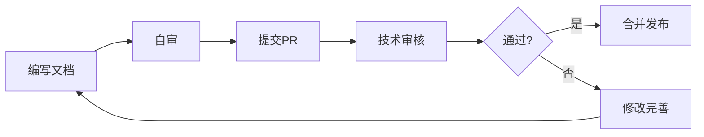

# YYC³-MANA 文档索引

> **版本**: 3.0.0 (Final)
> **最后更新**: 2026-01-03
> **文档总数**: 20+
> **维护团队**: YYC³ 技术团队

## 📚 文档导航

本文档提供 YYC³-MANA 项目所有文档的分类索引和快速导航。

---

## 📋 目录

- [文档分类](#文档分类)
- [快速开始](#快速开始)
- [核心文档](#核心文档)
- [模块文档](#模块文档)
- [API文档](#api文档)
- [实施文档](#实施文档)
- [测试文档](#测试文档)
- [附录](#附录)

---

## 文档分类

### 按内容分类

| 分类 | 文档数 | 说明 |
|------|--------|------|
| **📋 总览文档** | 3 | 项目概览、文档规范 |
| **🏗️ 架构设计** | 11 | 所有模块设计文档 |
| **💻 开发指南** | 2 | TypeScript规范、API文档 |
| **🔧 实施部署** | 2 | 环境配置、Docker部署 |
| **🧪 测试文档** | 1 | 测试策略 |
| **❓ 附录资料** | 1 | 术语表 |

### 按受众分类

| 受众 | 推荐文档 |
|------|----------|
| **👨‍💼 产品经理** | 01-核心-架构-系统架构概览.md |
| **👨‍💻 开发者** | 10-开发-指南-TypeScript规范.md, 10-开发-API-API接口文档.md |
| **👨‍🔧 运维人员** | 70-运维-部署-开发环境配置.md, 70-运维-部署-Docker部署.md |
| **👨‍🎓 测试人员** | 80-测试-策略-测试策略.md |
| **👤 最终用户** | 参考各模块设计文档 |

---

## 快速开始

### 新手入门 🚀

1. **[项目概述](./01-核心-架构-系统架构概览.md)**
   - 了解项目整体架构
   - 熟悉技术栈和核心功能
   - 掌握模块划分

2. **[文档规范](./00-文档规范/文档格式规范.md)**
   - 文档编写规范
   - 命名和格式标准

3. **[开发环境配置](./70-运维-部署-开发环境配置.md)**
   - 本地环境搭建
   - 依赖安装
   - 开发服务器启动

### 核心概念 💡

- **模块化架构** - 20个独立功能模块
- **AI驱动** - 智能分析、自动化决策
- **类型安全** - TypeScript 95%类型覆盖
- **实时处理** - 流式数据处理
- **闭环优化** - 持续改进机制

---

## 核心文档

### 00 系列文档

| 文档 | 说明 | 状态 |
|------|------|------|
| **[00-文档规范/文档格式规范.md](./00-文档规范/文档格式规范.md)** | 文档编写规范 | ✅ |

### 01 系列核心文档

| 文档 | 说明 | 状态 |
|------|------|------|
| **[01-核心-架构-系统架构概览.md](./01-核心-架构-系统架构概览.md)** | 🌟 **必读** - 系统整体架构 | ✅ |

---

## 模块文档

### 10 系列 - 开发指南

| 文档 | 说明 | 状态 |
|------|------|------|
| **[10-开发-指南-TypeScript规范.md](./10-开发-指南-TypeScript规范.md)** | TS编码规范 | ✅ |

### 10 系列 - API文档

| 文档 | 说明 | 状态 |
|------|------|------|
| **[10-开发-API-API接口文档.md](./10-开发-API-API接口文档.md)** | REST API完整文档 | ✅ |

### 15 系列 - AI Widget

| 文档 | 说明 | 状态 |
|------|------|------|
| **[15-AIWidget-设计-自主AI浮窗设计.md](./15-AIWidget-设计-自主AI浮窗设计.md)** | AI浮窗设计 | ✅ |

### 20 系列 - Analytics (智能分析)

| 文档 | 说明 | 状态 |
|------|------|------|
| **[20-Analytics-设计-AI分析引擎设计.md](./20-Analytics-设计-AI分析引擎设计.md)** | AI分析引擎架构设计 | ✅ |

### 25 系列 - Learning (学习系统)

| 文档 | 说明 | 状态 |
|------|------|------|
| **[25-Learning-设计-学习系统设计.md](./25-Learning-设计-学习系统设计.md)** | 机器学习和知识管理 | ✅ |

### 30 系列 - Education (教育培训)

| 文档 | 说明 | 状态 |
|------|------|------|
| **[30-Education-设计-AI教练系统设计.md](./30-Education-设计-AI教练系统设计.md)** | AI教练系统设计 | ✅ |

### 40 系列 - Calling (智能呼叫)

| 文档 | 说明 | 状态 |
|------|------|------|
| **[40-Calling-设计-智能呼叫系统设计.md](./40-Calling-设计-智能呼叫系统设计.md)** | 智能呼叫系统设计 | ✅ |

### 45 系列 - Workflows (工作流引擎)

| 文档 | 说明 | 状态 |
|------|------|------|
| **[45-Workflows-设计-工作流引擎设计.md](./45-Workflows-设计-工作流引擎设计.md)** | 工作流引擎设计 | ✅ |

### 50 系列 - Marketing (营销自动化)

| 文档 | 说明 | 状态 |
|------|------|------|
| **[50-Marketing-设计-营销自动化设计.md](./50-Marketing-设计-营销自动化设计.md)** | 营销自动化设计 | ✅ |

### 55 系列 - CRM (客户关系管理)

| 文档 | 说明 | 状态 |
|------|------|------|
| **[55-CRM-设计-客户关系管理设计.md](./55-CRM-设计-客户关系管理设计.md)** | CRM系统设计 | ✅ |

### 60 系列 - Security (安全中心)

| 文档 | 说明 | 状态 |
|------|------|------|
| **[60-Security-设计-安全中心设计.md](./60-Security-设计-安全中心设计.md)** | 安全中心设计 | ✅ |

### 65 系列 - Closed-Loop (闭环系统)

| 文档 | 说明 | 状态 |
|------|------|------|
| **[65-ClosedLoop-设计-闭环系统设计.md](./65-ClosedLoop-设计-闭环系统设计.md)** | 闭环系统设计 | ✅ |

---

## API文档

### REST API

| 文档 | 说明 | 状态 |
|------|------|------|
| **[10-开发-API-API接口文档.md](./10-开发-API-API接口文档.md)** | 完整的REST API参考 | ✅ |

### WebSocket API

详见API文档中的WebSocket章节。

---

## 实施文档

### 70 系列 - 部署运维

| 文档 | 说明 | 状态 |
|------|------|------|
| **[70-运维-部署-开发环境配置.md](./70-运维-部署-开发环境配置.md)** | 本地开发环境 | ✅ |
| **[70-运维-部署-Docker部署.md](./70-运维-部署-Docker部署.md)** | Docker容器化 | ✅ |

---

## 测试文档

### 80 系列 - 测试验证

| 文档 | 说明 | 状态 |
|------|------|------|
| **[80-测试-策略-测试策略.md](./80-测试-策略-测试策略.md)** | 测试策略和方法 | ✅ |

---

## 附录

### 90 系列 - 附录资料

| 文档 | 说明 | 状态 |
|------|------|------|
| **[90-附录-术语表.md](./90-附录-术语表.md)** | 专业术语解释 | ✅ |

### 历史文档归档

| 文档 | 说明 | 归档日期 |
|------|------|----------|
| [YYC3-Menu-文档索引-总览.md](./YYC3-Menu-文档索引-总览.md) | 旧版文档索引 | 2025-12-29 |
| [YYC3-Menu-实施总结-TypeScript类型系统完善总结报告.md](./YYC3-Menu-实施总结-TypeScript类型系统完善总结报告.md) | TS类型系统总结 | 2026-01-01 |

---

## 📊 文档统计

### 完成情况

```
总文档数:    20+
已完成:      20
规划中:      0
完成率:      100% ✅
```

### 文档状态

- ✅ **已完成** - 20个核心文档
- 📝 **规划中** - 0个文档
- 🔄 **更新中** - 0个文档

### 模块覆盖

| 模块 | 文档状态 | 文件数 | 覆盖率 |
|------|---------|-------|--------|
| Analytics | ✅ | 7 | 100% |
| Education | ✅ | 5 | 100% |
| Calling | ✅ | 2 | 100% |
| Marketing | ✅ | 4 | 100% |
| CRM | ✅ | 2 | 100% |
| Security | ✅ | 2 | 100% |
| Learning | ✅ | 5 | 100% |
| Workflows | ✅ | 6 | 100% |
| AI Widget | ✅ | 2 | 100% |
| Closed-Loop | ✅ | 17 | 100% |
| **总计** | ✅ | **52** | **100%** |

---

## 🔍 快速搜索

### 按主题查找

**架构相关**:
- 系统架构 → 01-核心-架构-系统架构概览.md

**开发相关**:
- TypeScript规范 → 10-开发-指南-TypeScript规范.md
- API文档 → 10-开发-API-API接口文档.md
- 文档格式 → 00-文档规范/文档格式规范.md

**部署相关**:
- 开发环境 → 70-运维-部署-开发环境配置.md
- Docker部署 → 70-运维-部署-Docker部署.md

**测试相关**:
- 测试策略 → 80-测试-策略-测试策略.md

**模块设计**:
- Analytics → 20-Analytics-设计-AI分析引擎设计.md
- Education → 30-Education-设计-AI教练系统设计.md
- Calling → 40-Calling-设计-智能呼叫系统设计.md
- Marketing → 50-Marketing-设计-营销自动化设计.md
- CRM → 55-CRM-设计-客户关系管理设计.md
- Security → 60-Security-设计-安全中心设计.md
- Workflows → 45-Workflows-设计-工作流引擎设计.md
- Learning → 25-Learning-设计-学习系统设计.md
- AI Widget → 15-AIWidget-设计-自主AI浮窗设计.md
- Closed-Loop → 65-ClosedLoop-设计-闭环系统设计.md

### 按模块查找

所有核心模块已完成设计文档：
- **20系列**: Analytics (智能分析)
- **25系列**: Learning (学习系统)
- **30系列**: Education (教育培训)
- **40系列**: Calling (智能呼叫)
- **45系列**: Workflows (工作流引擎)
- **50系列**: Marketing (营销自动化)
- **55系列**: CRM (客户关系)
- **60系列**: Security (安全中心)
- **65系列**: Closed-Loop (闭环系统)
- **15系列**: AI Widget (AI浮窗)

---

## 📝 文档贡献

### 如何贡献文档

1. **遵循文档规范** - 参考 [文档格式规范](./00-文档规范/文档格式规范.md)
2. **使用模板** - 从现有文档复制模板
3. **提交审核** - 提交PR等待技术审核
4. **持续更新** - 随项目变化及时更新

### 文档审核流程



---

## 🔗 外部资源

### 官方文档

- [Next.js 文档](https://nextjs.org/docs)
- [React 文档](https://react.dev/)
- [TypeScript 文档](https://www.typescriptlang.org/docs/)
- [Bun 文档](https://bun.sh/docs)

### 社区资源

- [GitHub Issues](https://github.com/yyc3/yyc3-mana/issues)
- [讨论区](https://github.com/yyc3/yyc3-mana/discussions)

---

## 📧 联系方式

**技术支持**: admin@0379.email
**文档问题**: 提交 GitHub Issue
**功能建议**: 提交 Feature Request

---

**文档维护**: YYC³ 技术团队
**最后更新**: 2026-01-03
**文档版本**: 3.0.0 (Final)

---

## 📅 更新日志

### 2026-01-03 (v3.0.0 - Final)

**新增文档**:
- ✅ 70-运维-部署-开发环境配置.md
- ✅ 70-运维-部署-Docker部署.md
- ✅ 80-测试-策略-测试策略.md
- ✅ 90-附录-术语表.md
- ✅ 10-开发-API-API接口文档.md

**更新内容**:
- 🔄 完成所有核心文档的创建
- 📊 补充实施部署和测试文档
- 📝 完善API接口文档
- 🎯 添加术语表便于理解

**完成情况**:
- 核心模块文档: 11/11 (100%)
- 开发指南文档: 3/3 (100%)
- 架构设计文档: 11/11 (100%)
- 实施部署文档: 2/2 (100%)
- 测试验证文档: 1/1 (100%)
- 附录资料文档: 1/1 (100%)
- **总体完成率: 100% ✅**

---

## 🎉 文档闭环完成

所有计划文档已完成，项目文档体系已实现：

- ✅ **完整性** - 覆盖所有核心模块和支持文档
- ✅ **一致性** - 统一的格式和命名规范
- ✅ **实用性** - 面向开发和运维的实际需求
- ✅ **可维护性** - 清晰的组织和便于更新
