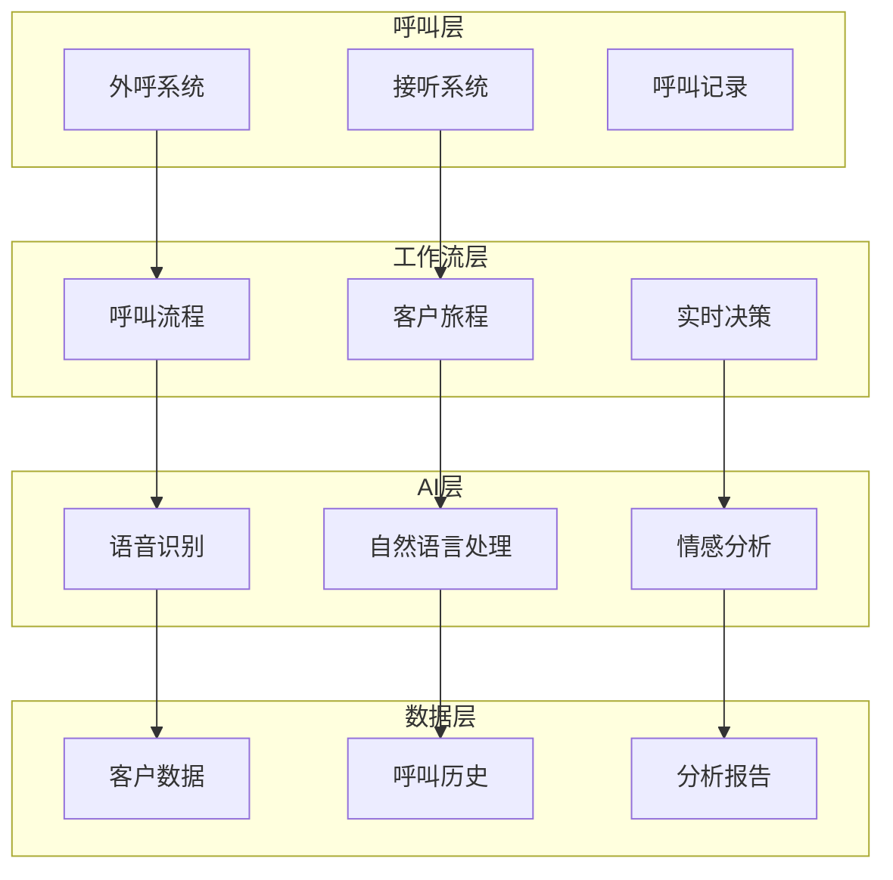

# Calling 模块设计文档

> **文档类型**: 设计
> **所属模块**: Calling (智能呼叫)
> **版本**: 1.0.0
> **创建日期**: 2026-01-03
> **最后更新**: 2026-01-03
> **维护人**: YYC³ Calling Team

## 1. 模块概述

### 1.1 功能简介

Calling 模块是 YYC³-MANA 的智能呼叫系统，提供：

- 📞 **智能呼叫** - AI驱动的自动化呼叫
- 🔄 **工作流编排** - 灵活的呼叫流程管理
- 👤 **客户生命周期** - 完整的客户旅程管理
- 💬 **实时助手** - 呼叫过程中的实时智能辅助
- 📊 **呼叫分析** - 详细的呼叫数据分析

### 1.2 核心组件

```
core/calling/
├── EnhancedCallingSystem.ts      # 增强呼叫系统
└── types.ts                      # 类型定义

core/workflows/
├── IntelligentCallingWorkflow.ts # 智能呼叫工作流
├── CustomerLifecycleWorkflow.ts  # 客户生命周期工作流
├── RealTimeCallAssistant.ts      # 实时呼叫助手
└── types.ts                      # 类型定义
```

## 2. 架构设计

### 2.1 系统架构



### 2.2 数据流

```typescript
interface CallingDataFlow {
  // 1. 呼叫触发
  trigger: {
    source: 'outbound' | 'inbound';
    customer: Customer;
    campaign?: Campaign;
  };

  // 2. 工作流执行
  workflow: {
    execution: WorkflowExecution;
    decision: RealTimeDecision;
    adaptation: WorkflowAdaptation;
  };

  // 3. AI处理
  ai: {
    speechRecognition: SpeechRecognition;
    nlp: NaturalLanguageProcessing;
    sentiment: SentimentAnalysis;
  };

  // 4. 数据记录
  recording: {
    callLog: CallLog;
    customerUpdate: CustomerUpdate;
    analytics: CallAnalytics;
  };
}
```

## 3. 核心组件设计

### 3.1 EnhancedCallingSystem

**职责**: 增强型呼叫系统核心

```typescript
export class EnhancedCallingSystem {
  private _aiModel: AIModel;
  private _workflowEngine: WorkflowEngine;

  /**
   * 执行智能外呼
   */
  async executeIntelligentCall(
    customer: Customer,
    script: CallScript
  ): Promise<CallResult> {
    // 1. 准备呼叫
    const context = await this.prepareCallContext(customer);

    // 2. 执行呼叫
    const call = await this.initiateCall(customer);

    // 3. 实时AI辅助
    const assistance = await this.provideRealTimeAssistance(call, context);

    // 4. 记录和分析
    const recording = await this.recordAndAnalyze(call);

    return {
      outcome: call.outcome,
      duration: call.duration,
      transcript: recording.transcript,
      sentiment: recording.sentiment,
      nextActions: await this.determineNextActions(recording)
    };
  }

  /**
   * 批量呼叫处理
   */
  async processBatchCalls(
    customers: Customer[],
    campaign: Campaign
  ): Promise<BatchCallResult> {
    const results = await Promise.allSettled(
      customers.map(customer => this.executeIntelligentCall(customer, campaign.script))
    );

    return {
      successful: results.filter(r => r.status === 'fulfilled').length,
      failed: results.filter(r => r.status === 'rejected').length,
      details: results.map((result, index) => ({
        customer: customers[index],
        result: result.status === 'fulfilled' ? result.value : null
      }))
    };
  }
}
```

**核心功能**:
- 智能外呼执行
- 实时AI辅助
- 批量呼叫处理
- 呼叫结果分析

### 3.2 IntelligentCallingWorkflow

**职责**: 智能呼叫工作流引擎

```typescript
export class IntelligentCallingWorkflow {
  /**
   * 创建工作流
   */
  async createWorkflow(
    definition: WorkflowDefinition
  ): Promise<CallingWorkflow> {
    const steps = await this.defineSteps(definition);
    const rules = await this.defineRules(definition);
    const integrations = await this.setupIntegrations(definition);

    return {
      id: generateId(),
      name: definition.name,
      steps,
      rules,
      integrations,
      version: '1.0.0'
    };
  }

  /**
   * 执行工作流
   */
  async executeWorkflow(
    workflow: CallingWorkflow,
    context: CallContext
  ): Promise<WorkflowExecution> {
    let currentStep = workflow.steps[0];
    const execution = {
      workflowId: workflow.id,
      startTime: new Date(),
      steps: [],
      status: 'in_progress' as const
    };

    while (currentStep) {
      // 执行当前步骤
      const result = await this.executeStep(currentStep, context);

      // 记录步骤执行
      execution.steps.push({
        step: currentStep,
        result,
        timestamp: new Date()
      });

      // 决策下一步
      currentStep = await this.decideNextStep(
        workflow,
        currentStep,
        result,
        context
      );
    }

    execution.status = 'completed';
    execution.endTime = new Date();

    return execution;
  }

  /**
   * 实时工作流调整
   */
  async adaptWorkflow(
    workflow: CallingWorkflow,
    performance: PerformanceMetrics
  ): Promise<CallingWorkflow> {
    // 基于性能指标动态调整工作流
    if (performance.conversionRate < 0.3) {
      workflow = await this.optimizeConversion(workflow);
    }

    if (performance.avgCallDuration > 600) {
      workflow = await this.optimizeDuration(workflow);
    }

    return workflow;
  }
}
```

**工作流特性**:
- 可视化流程设计
- 实时决策节点
- 动态路径调整
- A/B测试支持

### 3.3 CustomerLifecycleWorkflow

**职责**: 客户生命周期管理

```typescript
export class CustomerLifecycleWorkflow {
  /**
   * 创建客户旅程
   */
  async createJourney(
    customer: Customer,
    stage: LifecycleStage
  ): Promise<CustomerJourney> {
    const touchpoints = await this.defineTouchpoints(stage);
    const timeline = await this.createTimeline(touchpoints);
    const goals = await this.defineGoals(stage);

    return {
      customerId: customer.id,
      currentStage: stage,
      touchpoints,
      timeline,
      goals,
      progress: 0
    };
  }

  /**
   * 推进客户旅程
   */
  async advanceJourney(
    journey: CustomerJourney,
    interaction: Interaction
  ): Promise<CustomerJourney> {
    // 更新进度
    journey.progress = await this.calculateProgress(journey, interaction);

    // 检查是否可以进入下一阶段
    if (await this.readyForNextStage(journey)) {
      journey.currentStage = await this.getNextStage(journey.currentStage);
      journey.touchpoints = await this.defineTouchpoints(journey.currentStage);
    }

    return journey;
  }

  /**
   * 个性化旅程
   */
  async personalizeJourney(
    journey: CustomerJourney,
    customer: Customer
  ): Promise<CustomerJourney> {
    const preferences = await this.analyzePreferences(customer);
    const behavior = await this.analyzeBehavior(customer);

    // 根据偏好和行为调整接触点
    journey.touchpoints = journey.touchpoints.map(tp => ({
      ...tp,
      channel: preferences.preferredChannel,
      timing: this.optimalTiming(behavior),
      content: this.personalizeContent(tp.content, customer)
    }));

    return journey;
  }
}
```

**生命周期阶段**:
- 潜在客户 → 初步接触
- 新客户 → 欢迎和引导
- 活跃客户 → 持续互动
- 流失风险 → 挽回措施
- 忠诚客户 → 增值服务

### 3.4 RealTimeCallAssistant

**职责**: 实时呼叫智能助手

```typescript
export class RealTimeCallAssistant {
  /**
   * 实时语音识别
   */
  async transcribeCall(
    audioStream: AudioStream
  ): AsyncGenerator<TranscriptSegment> {
    while (true) {
      const audioChunk = await audioStream.next();

      // 实时转录
      const transcript = await this.aiModel.transcribe(audioChunk);

      yield {
        text: transcript.text,
        speaker: transcript.speaker,
        timestamp: new Date(),
        confidence: transcript.confidence
      };
    }
  }

  /**
   * 实时情感分析
   */
  async analyzeSentiment(
    transcript: TranscriptSegment
  ): Promise<SentimentAnalysis> {
    return {
      sentiment: await this.detectSentiment(transcript.text),
      emotion: await this.detectEmotion(transcript.text),
      urgency: await this.assessUrgency(transcript.text),
      suggestions: await this.generateSuggestions(transcript)
    };
  }

  /**
   * 智能提示
   */
  async providePrompts(
    context: CallContext,
    transcript: Transcript
  ): Promise<CallPrompts> {
    return {
      nextQuestions: await this.suggestNextQuestions(context, transcript),
      objectionHandling: await this.handleObjections(transcript),
      closingSignals: await this.detectClosingSignals(transcript),
      riskFlags: await this.detectRisks(transcript)
    };
  }
}
```

**实时辅助功能**:
- 实时转录显示
- 情感状态监控
- 话术智能提示
- 异常风险预警

## 4. 数据模型

### 4.1 核心类型定义

```typescript
// 呼叫记录
export interface CallRecord {
  id: string;
  customerId: string;
  type: 'inbound' | 'outbound';
  startTime: Date;
  endTime?: Date;
  duration?: number;
  outcome: CallOutcome;
  transcript?: Transcript;
  sentiment?: SentimentAnalysis;
  nextActions?: Action[];
}

// 工作流定义
export interface WorkflowDefinition {
  name: string;
  description: string;
  steps: WorkflowStep[];
  rules: BusinessRule[];
  integrations: Integration[];
}

// 客户旅程
export interface CustomerJourney {
  customerId: string;
  currentStage: LifecycleStage;
  touchpoints: Touchpoint[];
  timeline: Timeline;
  goals: JourneyGoal[];
  progress: number;
}
```

### 4.2 性能指标

```typescript
export interface CallingMetrics {
  totalCalls: number;
  connectedCalls: number;
  connectionRate: number;
  avgDuration: number;
  conversionRate: number;
  customerSatisfaction: number;
}
```

## 5. API接口

### 5.1 REST API

```typescript
// POST /api/calling/execute
// 执行呼叫
interface ExecuteCallRequest {
  customerId: string;
  workflowId: string;
  script?: CallScript;
}

interface ExecuteCallResponse {
  callId: string;
  status: 'initiated' | 'connected' | 'completed';
  result?: CallResult;
}

// POST /api/workflows/create
// 创建工作流
interface CreateWorkflowRequest {
  name: string;
  steps: WorkflowStep[];
  rules: BusinessRule[];
}

// GET /api/calling/analytics
// 获取呼叫分析
interface AnalyticsResponse {
  metrics: CallingMetrics;
  trends: Trend[];
  insights: Insight[];
}
```

### 5.2 WebSocket API

```typescript
// 实时呼叫流
ws://localhost:3000/api/calling/stream

// 消息格式
interface CallStreamMessage {
  type: 'transcript' | 'sentiment' | 'prompt' | 'status';
  callId: string;
  data: any;
  timestamp: Date;
}
```

## 6. 使用示例

### 6.1 执行智能呼叫

```typescript
// 初始化呼叫系统
const callingSystem = new EnhancedCallingSystem();

// 执行单个呼叫
const result = await callingSystem.executeIntelligentCall(
  customer,
  callScript
);

console.log('呼叫结果:', result.outcome);
console.log('转录文本:', result.transcript);
console.log('情感分析:', result.sentiment);

// 批量呼叫
const batchResult = await callingSystem.processBatchCalls(
  customers,
  campaign
);
```

### 6.2 创建工作流

```typescript
// 工作流引擎
const workflowEngine = new IntelligentCallingWorkflow();

// 创建工作流
const workflow = await workflowEngine.createWorkflow({
  name: '销售外呼流程',
  steps: [
    { name: '开场', action: 'greet' },
    { name: '需求分析', action: 'analyze_needs' },
    { name: '产品介绍', action: 'present_product' },
    { name: '异议处理', action: 'handle_objections' },
    { name: '成交', action: 'close_deal' }
  ],
  rules: [
    { condition: 'interested', nextStep: '产品介绍' },
    { condition: 'not_interested', nextStep: '结束' }
  ]
});

// 执行工作流
const execution = await workflowEngine.executeWorkflow(workflow, context);
```

### 6.3 实时辅助

```typescript
// 实时助手
const assistant = new RealTimeCallAssistant();

// WebSocket连接
const ws = new WebSocket('ws://localhost:3000/api/calling/stream');

ws.onmessage = async (event) => {
  const message: CallStreamMessage = JSON.parse(event.data);

  switch (message.type) {
    case 'transcript':
      updateTranscriptDisplay(message.data);
      break;
    case 'sentiment':
      updateSentimentIndicator(message.data);
      break;
    case 'prompt':
      showPrompt(message.data);
      break;
  }
};
```

## 7. 最佳实践

### 7.1 呼叫策略

- ✅ **精准定位** - 明确目标客户群体
- ✅ **个性化话术** - 根据客户特点定制
- ✅ **时机选择** - 选择最佳呼叫时间
- ✅ **持续优化** - 基于数据持续改进
- ✅ **合规优先** - 遵守相关法规

### 7.2 工作流设计

- ✅ **简洁高效** - 避免不必要的步骤
- ✅ **灵活可配** - 支持动态调整
- ✅ **明确目标** - 每步都有清晰目标
- ✅ **异常处理** - 完善的异常分支
- ✅ **数据驱动** - 基于数据分析优化

## 附录

### A. 相关文档

- [01-核心-架构-系统架构概览.md](../01-核心-架构-系统架构概览.md)
- [40-Calling-工作流-呼叫工作流设计.md](./40-Calling-工作流-呼叫工作流设计.md)

### B. 变更记录

| 版本 | 日期 | 作者 | 变更内容 |
|------|------|------|----------|
| 1.0.0 | 2026-01-03 | YYC³ | 初始版本 |

---

**模块维护**: YYC³ Calling Team
**联系方式**: admin@0379.email
