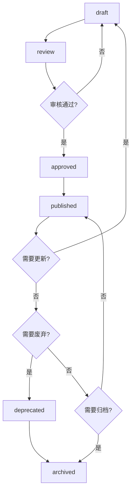
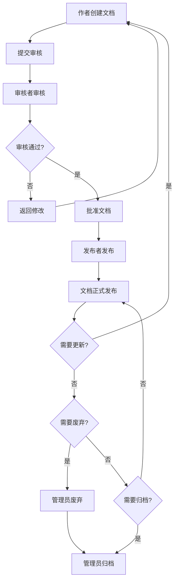
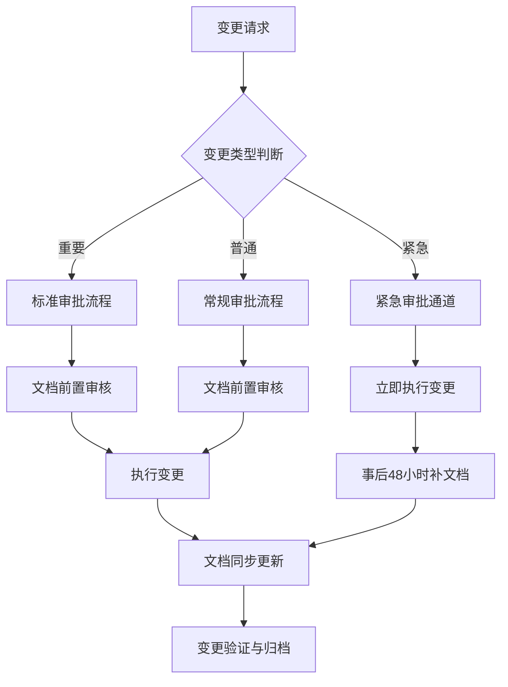
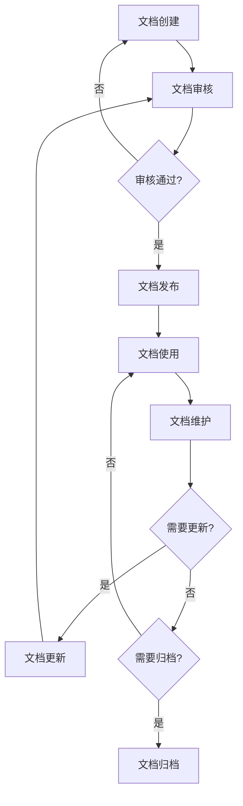
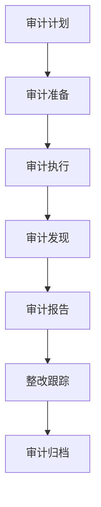
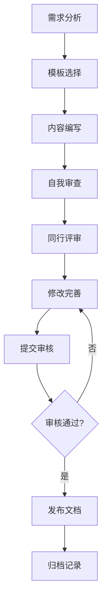
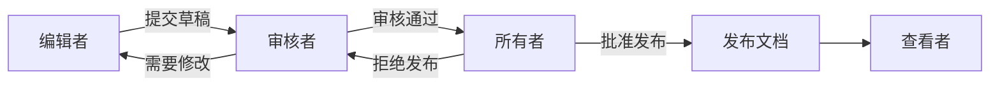

# YYC³ YYC3智能编程文档管理标准要求规范

---

> **文档头部信息标准**
>
> ```
> ---
> @file: 文档名称（格式：YYC3-[项目名称]-[文档类型]-[具体名称].md）
> @description: 文档描述（1-2句话说明文档用途）
> @author: 作者姓名/团队
> @version: 版本号（格式：v1.0.0）
> @created: 创建日期（格式：YYYY-MM-DD）
> @updated: 最后更新日期（格式：YYYY-MM-DD）
> @status: 文档状态（draft/review/approved/published/deprecated/archived）
> @tags: 标签1,标签2,标签3
> ---
> ```

---

> ***YanYuCloudCube***
> **标语**：言启象限 | 语枢未来
> ***Words Initiate Quadrants, Language Serves as Core for the Future***
> **标语**：万象归元于云枢 | 深栈智启新纪元
> ***All things converge in the cloud pivot; Deep stacks ignite a new era of intelligence***

---

## **“五高”战略定位**

- 高起点规划：基于行业前瞻趋势进行顶层设计
- 高标准建设：采用业界领先技术架构与设备标准
- 高效率运营：优化全链路业务流程
- 高质量服务：提升顾客体验满意度
- 高效益回报：确保投资产出合理化

## **“五标”体系构建**

- 流程标准化：SOP数字化落地
- 数据标准化：统一数据规范与接口
- 服务标准化：一致性服务体验
- 安全标准化：全方位安全保障体系
- 评价标准化：多维量化评估指标

## **“五化”实现路径**

- 数字化：全要素数据采集与转换
- 网络化：全域互联互通
- 智能化：AI驱动决策与执行
- 自动化：减少人工干预环节
- 生态化：产业链协同整合

---

## 📖 项目文档概览

本文档索引集中管理YYC³智枢服务化平台的所有技术文档，提供清晰的导航和查阅路径，确保参与代码、文档编辑生成的所有团队成员/导师能够快速定位所需资料。

## 📋 文档概述

### 1.1 文档目的

本文档定义了YYC3智能编程项目的文档管理标准要求，基于"五高五标五化"核心机制，建立全生命周期文档管理规范，确保文档质量、可维护性和可追溯性。

### 1.2 适用范围

本文档适用于YYC3智能编程项目的所有文档，包括但不限于：

- 技术文档
- 业务文档
- 管理文档
- 培训文档
- 用户文档

### 1.3 文档版本管理

#### 1.3.1 版本号规范

```yaml
版本号格式: v{主版本}.{次版本}.{修订版本}

主版本 (Major):
  - 不兼容的API变更
  - 重大架构调整
  - 核心功能移除
  
次版本 (Minor):
  - 向下兼容的功能新增
  - 功能模块扩展
  - 性能优化
  
修订版本 (Patch):
  - 向下兼容的问题修复
  - 文档错误修正
  - 小型改进
```

#### 1.3.2 版本变更记录

```typescript
// types/documentVersionTypes.ts
/**
 * @description 文档版本记录类型
 * @project 智枢服务化平台
 */
export interface DocumentVersion {
  version: string;
  releaseDate: Date;
  changes: VersionChange[];
  author: string;
  approvalStatus: 'pending' | 'approved' | 'rejected';
}

export interface VersionChange {
  type: 'added' | 'modified' | 'removed' | 'fixed';
  description: string;
  affectedSections: string[];
  breakingChange: boolean;
}
```

### 1.4 文档状态管理

#### 1.4.1 文档状态定义

```yaml
文档状态:
  draft: 草稿
    - 文档正在编写中
    - 不对外发布
    - 作者可自由修改
    
  review: 审核中
    - 文档已完成初稿
    - 提交审核流程
    - 审核者可提出修改意见
    
  approved: 已批准
    - 文档通过审核
    - 准备发布
    - 等待发布时间
    
  published: 已发布
    - 文档已正式发布
    - 对外可见
    - 持续维护中
    
  deprecated: 已废弃
    - 文档不再维护
    - 标记为废弃
    - 推荐替代文档
    
  archived: 已归档
    - 文档已归档
    - 不再使用
    - 仅保留历史记录
```

#### 1.4.2 文档状态转换规则



### 1.5 文档分类体系

#### 1.5.1 文档分类标准

```yaml
文档分类体系:
  按文档类型:
    - 技术文档: 架构设计、API文档、开发指南
    - 业务文档: 需求文档、业务流程、用户手册
    - 管理文档: 项目计划、会议记录、决策文档
    - 培训文档: 培训材料、操作指南、FAQ
    - 用户文档: 产品手册、使用指南、帮助文档
  
  按文档级别:
    - 项目级文档: 整体架构、总体规划、核心设计
    - 模块级文档: 模块设计、接口定义、实现细节
    - 功能级文档: 功能说明、使用指南、操作手册
    - 操作级文档: 操作步骤、配置说明、故障排查
  
  按文档受众:
    - 开发者文档: 技术实现、API参考、开发规范
    - 运维者文档: 部署指南、运维手册、监控告警
    - 管理者文档: 项目规划、进度报告、决策记录
    - 用户文档: 产品介绍、使用指南、常见问题
```

### 1.6 文档命名规范

#### 1.6.1 命名格式标准

```yaml
文档命名格式:
  项目级文档:
    - 格式: YYC3-[项目名称]-[文档类型]-[具体名称].md
  子模块级文档:
    - 格式: YYC3-[项目名称]-[子模块名称]-[文档类型]-[具体名称].md
  
  命名规则:
    - 使用kebab-case（短横线分隔）
    - 避免使用特殊字符
    - 名称简洁明了
    - 体现文档类型和内容
```

### 1.7 文档模板标准

#### 1.7.1 技术文档模板

```markdown
---
@file: YYC3-[项目名称]-技术-[文档名称].md
@description: 文档描述
@author: 作者姓名
@version: v1.0.0
@created: YYYY-MM-DD
@updated: YYYY-MM-DD
@status: published
@tags: 技术,架构,API
---

# 文档标题

## 1. 概述

### 1.1 文档目的
### 1.2 适用范围
### 1.3 术语定义

## 2. 技术架构

### 2.1 架构设计
### 2.2 技术选型
### 2.3 接口定义

## 3. 实现细节

### 3.1 核心功能
### 3.2 数据模型
### 3.3 业务逻辑

## 4. 部署指南

### 4.1 环境要求
### 4.2 部署步骤
### 4.3 配置说明

## 5. 附录

### 5.1 参考资料
### 5.2 变更记录
```

### 1.8 文档审批流程

#### 1.8.1 审批角色定义

```yaml
文档审批角色:
  文档作者:
    - 职责: 编写文档内容
    - 权限: 创建、编辑、提交审核
    - 状态: draft -> review
  
  文档审核者:
    - 职责: 审核文档质量和合规性
    - 权限: 审核、提出修改意见、批准/拒绝
    - 状态: review -> approved/rejected
  
  文档发布者:
    - 职责: 发布已批准的文档
    - 权限: 发布、更新发布状态
    - 状态: approved -> published
  
  文档管理员:
    - 职责: 管理文档生命周期
    - 权限: 归档、废弃、权限管理
    - 状态: published -> deprecated/archived
```

#### 1.8.2 审批流程规范



### 1.9 文档发布流程

#### 1.9.1 发布前检查清单

```markdown
## ✅ 文档发布前检查清单

### 内容检查
- [ ] 文档内容完整准确
- [ ] 文档格式符合规范
- [ ] 文档头部信息完整
- [ ] 文档版本号正确
- [ ] 文档状态正确

### 质量检查
- [ ] 文档逻辑清晰
- [ ] 文档语言规范
- [ ] 文档无错别字
- [ ] 文档无语法错误
- [ ] 文档无敏感信息

### 合规检查
- [ ] 符合YYC3规范
- [ ] 符合项目规则
- [ ] 符合命名规范
- [ ] 符合格式规范
- [ ] 符合安全规范

### 审批检查
- [ ] 审核流程完整
- [ ] 审核意见已处理
- [ ] 审核记录完整
- [ ] 审批人已批准
- [ ] 审批时间已记录
```

#### 1.9.2 发布流程规范

```yaml
文档发布流程:
  1. 准备阶段:
    - 确认文档状态为approved
    - 完成发布前检查清单
    - 准备发布通知
    - 确定发布时间
  
  2. 发布阶段:
    - 更新文档状态为published
    - 更新文档发布日期
    - 发送发布通知
    - 更新文档索引
  
  3. 发布后阶段:
    - 收集用户反馈
    - 监控文档使用情况
    - 处理文档问题
    - 记录发布结果
```

### 1.10 文档归档机制

#### 1.10.1 归档条件

```yaml
文档归档条件:
  自动归档:
    - 文档超过12个月未更新
    - 文档被标记为deprecated超过6个月
    - 文档所属项目已结束
  
  手动归档:
    - 文档内容已过时
    - 文档功能已移除
    - 文档被新文档替代
    - 文档不再需要维护
```

#### 1.10.2 归档流程

```typescript
// services/documentArchiveService.ts
/**
 * @description 文档归档服务
 * @project 智枢服务化平台
 */
export class DocumentArchiveService {
  /**
   * 归档文档
   */
  async archiveDocument(documentId: string, reason: string): Promise<void> {
    const document = await this.documentRepository.findById(documentId);
    
    // 验证归档条件
    if (!this.canArchive(document)) {
      throw new Error('文档不满足归档条件');
    }
    
    // 创建归档记录
    const archiveRecord = {
      documentId,
      originalPath: document.path,
      archivePath: this.generateArchivePath(document),
      archivedAt: new Date(),
      archivedBy: this.getCurrentUser(),
      reason,
      metadata: {
        version: document.version,
        status: document.status,
        lastUpdated: document.updatedAt
      }
    };
    
    // 移动文档到归档目录
    await this.moveToArchive(document, archiveRecord.archivePath);
    
    // 更新文档状态
    await this.documentRepository.update(documentId, {
      status: 'archived',
      archivedAt: new Date()
    });
    
    // 保存归档记录
    await this.archiveRepository.save(archiveRecord);
    
    // 发送归档通知
    await this.notifyArchived(document, archiveRecord);
  }
  
  /**
   * 检查文档是否可以归档
   */
  private canArchive(document: Document): boolean {
    const lastUpdate = document.updatedAt;
    const monthsSinceUpdate = this.getMonthsSince(lastUpdate);
    
    return document.status === 'deprecated' && monthsSinceUpdate >= 6 ||
           document.status === 'published' && monthsSinceUpdate >= 12;
  }
}
```

### 1.11 文档备份恢复机制

#### 1.11.1 备份策略

```yaml
文档备份策略:
  备份频率:
    - 增量备份: 每日
    - 完整备份: 每周
    - 归档备份: 每月
  
  备份类型:
    - 本地备份: 备份到本地存储
    - 远程备份: 备份到云存储
    - 异地备份: 备份到异地数据中心
  
  备份保留:
    - 增量备份: 保留7天
    - 完整备份: 保留4周
    - 归档备份: 保留12个月
  
  备份验证:
    - 每周验证备份完整性
    - 每月测试备份恢复
    - 每季度进行灾难恢复演练
```

#### 1.11.2 恢复流程

```typescript
// services/documentBackupService.ts
/**
 * @description 文档备份恢复服务
 * @project 智枢服务化平台
 */
export class DocumentBackupService {
  /**
   * 创建文档备份
   */
  async createBackup(documentId: string): Promise<BackupRecord> {
    const document = await this.documentRepository.findById(documentId);
    
    const backup = {
      id: generateUUID(),
      documentId,
      backupType: 'incremental',
      backupPath: this.generateBackupPath(document),
      backupDate: new Date(),
      backupSize: document.content.length,
      checksum: this.calculateChecksum(document.content),
      metadata: {
        version: document.version,
        status: document.status,
        author: document.author
      }
    };
    
    // 创建备份文件
    await this.createBackupFile(document, backup.backupPath);
    
    // 保存备份记录
    await this.backupRepository.save(backup);
    
    return backup;
  }
  
  /**
   * 恢复文档备份
   */
  async restoreBackup(backupId: string): Promise<void> {
    const backup = await this.backupRepository.findById(backupId);
    
    // 验证备份完整性
    if (!this.verifyBackup(backup)) {
      throw new Error('备份文件损坏');
    }
    
    // 创建当前文档的备份
    await this.createBackup(backup.documentId);
    
    // 恢复文档
    const backupContent = await this.readBackupFile(backup.backupPath);
    await this.documentRepository.update(backup.documentId, {
      content: backupContent,
      version: backup.metadata.version,
      restoredAt: new Date(),
      restoredFrom: backupId
    });
    
    // 记录恢复操作
    await this.logRestoreOperation(backup);
    
    // 发送恢复通知
    await this.notifyRestored(backup);
  }
}
```

---

## 🏗️ 核心技术文档

### 1. 架构设计文档

- **文档名称**: [智枢服务化平台系统架构设计.md](智枢服务化平台系统架构设计.md)
- **文档版本**: v1.0
- **最后更新**: 2024-03-20
- **主要内容**: 四层一体分层架构设计、核心组件配置、单元自治架构、智能运维能力
- **适用范围**: 技术架构师、开发团队、运维团队

### 2. 技术实施指南

- **文档名称**: [智枢服务化平台技术实施指南.md](智枢服务化平台技术实施指南.md)
- **文档版本**: v1.0
- **最后更新**: 2024-03-20
- **主要内容**: 基础设施部署、数据层建设、平台层实施、应用层开发
- **适用范围**: 开发团队、运维团队、实施工程师

### 3. 服务开发指南

- **文档名称**: [智枢服务化平台规划服务开发指南.md](智枢服务化平台规划服务开发指南.md)
- **文档版本**: v1.0
- **最后更新**: 2024-03-20
- **主要内容**: 服务命名规范、目录结构、编码标准、服务间通信
- **适用范围**: 开发团队、服务设计者

### 4. API 手册

- **文档名称**: [智枢服务化平台规划API手册.md](智枢服务化平台规划API手册.md)
- **文档版本**: v1.0
- **最后更新**: 2024-03-20
- **主要内容**: API设计规范、统一响应格式、接口定义
- **适用范围**: 前后端开发团队、集成工程师

## 🔧 开发规范文档

### 5. 项目规则文件

- **文档名称**: [.trae/rules/project_rules.md](.trae/rules/project_rules.md)
- **文档版本**: v1.0
- **最后更新**: 2024-03-20
- **主要内容**: 技术栈配置、架构规范、业务规则、工具函数、测试规范
- **适用范围**: 所有开发人员、项目管理者

### 6. 开发清单

- **文档名称**: [开发清单.md](开发清单.md)
- **文档版本**: v1.0
- **最后更新**: 2024-03-20
- **主要内容**: 开发任务分解、优先级定义、时间线规划、启动准备
- **适用范围**: 项目管理者、开发团队、测试团队

## 📋 文档使用指南

### 新成员入职指南

1. 首先阅读 [智枢服务化平台系统架构设计.md](智枢服务化平台系统架构设计.md)，了解系统整体架构
2. 然后阅读 [智枢服务化平台规划服务开发指南.md](智枢服务化平台规划服务开发指南.md)，熟悉开发规范
3. 根据工作内容，选择阅读相应的实施指南或API手册
4. 查阅 [.trae/rules/project_rules.md](.trae/rules/project_rules.md)，严格遵守项目规则

### 文档更新流程

1. 文档修改必须遵循YYC³规范
2. 更新后必须修改文档头部的`@updated`日期
3. 重要修改需要更新文档版本号
4. 文档更新后需要同步更新本索引文件

### 文档搜索建议

- 使用关键词搜索相关文档
- 按模块分类查找所需文档
- 根据文档适用范围确定参考文档

## 📊 文档健康状态

### 文档完整性检查

- [x] 架构设计文档 - 已完成
- [x] 技术实施指南 - 已完成
- [x] 服务开发指南 - 已完成
- [x] API手册 - 已完成
- [x] 项目规则文件 - 已完成
- [x] 开发清单 - 已完成
- [x] 文档索引 - 已完成

### 规范符合性检查

- [x] YYC³文件头规范 - 已完成
- [x] 文档格式统一 - 已完成
- [x] 术语一致性 - 已完成
- [x] 架构描述一致性 - 已完成

## 📅 文档更新计划

| 文档名称 | 计划更新日期 | 更新内容 | 负责人 |
|---------|------------|---------|--------|
| 系统架构设计 | 2025-12-20 | 优化架构细节 | 架构师 |
| 技术实施指南 | 2025-12-20 | 更新实施案例 | 实施工程师 |
| 服务开发指南 | 2025-12-20 | 补充开发示例 | 技术负责人 |
| API手册 | 持续更新 | 完善API定义 | 开发团队 |

## 📝 文档管理说明

- **文档存储**: 所有文档存储在项目根目录下的`docs/`文件夹中，每个文档都须采用`YYC3-[项目名称]-[文档类型]-[具体名称].md`格式，分为以下几种情况：
- **项目级文档**：
  - 实施执行时直接引用的文档，例如项目设计文档、实施计划文档等。
  - 项目级文档：`YYC3-[项目名称]-[文档类型]-[具体名称].md`
    - 例如：
      - 实施执行时直接引用的文档，例如项目设计文档、实施计划文档等。
        - `YYC3-智枢-智能菜单图谱系统-开发设计文档.md`
      - 实施执行后需要更新/生成的文档，例如实施总结报告、审核规划建议等。
        - `YYC3-智枢-智能菜单图谱系统-实施总结报告.md`
        - `YYC3-智枢-智能菜单图谱系统-审核规划建议.md`

- **子模块级文档**：
  - 子模块级文档：`YYC3-[项目名称]-[子模块名称]-[文档类型]-[具体名称].md`
    - 例如：
      - `YYC3-智枢-智能菜单-服务开发指南.md`
      - `YYC3-智枢-智能菜单-API手册.md`
**同步更新**：项目级文档实施执行后需要与项目实施同步更新，确保项目设计与实际执行保持一致，总结执行结果、评估效果、改进建议等及时记录，生成文档保存并更新文档索引。

- **命名规范**: 采用`YYC3-[项目名称]-[文档类型]-[具体名称].md`格式
- **版本管理**: 遵循语义化版本号规范
- **更新记录**: 重要更新需要在文档末尾添加更新日志，记录更新准确时间、更新内容、更新人等信息。
- **索引更新**: 每次文档更新后，需要及时更新本索引文件，确保导航路径的准确性。
- **索引格式**: 采用Markdown格式，每个文档条目包含文档名称、文档版本、最后更新日期、主要内容、适用范围等信息。

---

## 🕐 时间变更管理机制（基于"五高五标五化"）

### 1. 高起点规划：时间变更管理框架

#### 1.1 时间变更定义与分类

```yaml
时间变更类型:
  🔴 紧急变更:
    - 定义: 影响系统稳定性或安全性的紧急修复
    - 响应时间: < 2小时
    - 审批流程: 紧急审批通道
    - 文档要求: 事后48小时内补充完整文档

  🟡 重要变更:
    - 定义: 影响业务功能或用户体验的重要更新
    - 响应时间: < 24小时
    - 审批流程: 标准审批流程
    - 文档要求: 变更前完成文档更新

  🟢 普通变更:
    - 定义: 常规优化或功能增强
    - 响应时间: < 72小时
    - 审批流程: 常规审批流程
    - 文档要求: 变更后及时更新文档
```

#### 1.2 时间变更管理流程



### 2. 高标准建设：时间变更文档标准

#### 2.1 变更文档头部规范

```markdown
---
@file: YYC3-智枢-[文档类型]-[具体名称].md
@description: [文档描述]
@author: [作者]
@version: [版本号]
@created: [创建日期]
@updated: [最后更新日期]
@change_type: [紧急/重要/普通]
@change_reason: [变更原因]
@change_impact: [变更影响范围]
@change_reviewer: [变更审核人]
---
```

#### 2.2 变更日志格式规范

```markdown
## 📋 变更日志

### [版本号] - [更新日期]
**变更类型**: [紧急/重要/普通]
**变更人**: [姓名]
**审核人**: [姓名]
**变更原因**: [详细说明]

**变更内容**:
- [ ] [变更项1]
- [ ] [变更项2]
- [ ] [变更项3]

**影响范围**:
- 模块: [受影响模块列表]
- 接口: [受影响接口列表]
- 数据: [受影响数据结构]

**验证结果**:
- [ ] 功能验证通过
- [ ] 性能验证通过
- [ ] 安全验证通过
- [ ] 兼容性验证通过

**相关文档**:
- [文档链接1]
- [文档链接2]
```

### 3. 高效率运营：时间变更自动化管理

#### 3.1 自动化变更追踪

```typescript
// services/changeTrackingService.ts
/**
 * @description 时间变更自动追踪服务
 * @project 智枢服务化平台
 */
export class ChangeTrackingService {
  /**
   * 记录变更事件
   */
  async recordChange(change: ChangeEvent): Promise<void> {
    const changeRecord = {
      id: generateUUID(),
      timestamp: new Date().toISOString(),
      type: change.type, // emergency | important | normal
      author: change.author,
      files: change.files,
      impact: change.impact,
      status: 'pending'
    };
    
    await this.changeRepository.save(changeRecord);
    
    // 根据变更类型触发不同流程
    if (change.type === 'emergency') {
      await this.triggerEmergencyWorkflow(changeRecord);
    } else {
      await this.triggerStandardWorkflow(changeRecord);
    }
  }
  
  /**
   * 检查文档同步状态
   */
  async checkDocumentSync(changeId: string): Promise<SyncStatus> {
    const change = await this.changeRepository.findById(changeId);
    const docs = await this.documentRepository.findByChangeId(changeId);
    
    return {
      changeId,
      requiredDocs: change.files.length,
      syncedDocs: docs.length,
      pendingDocs: change.files.length - docs.length,
      lastSyncTime: docs.length > 0 ? docs[0].updatedAt : null,
      isSyncComplete: docs.length === change.files.length
    };
  }
}
```

#### 3.2 文档同步自动化

```yaml
文档同步自动化配置:
  触发条件:
    - 代码提交后自动检测
    - 文件变更后自动触发
    - 定时检查（每小时）
  
  同步规则:
    - 代码变更 -> 自动生成变更日志
    - API变更 -> 自动更新API文档
    - 配置变更 -> 自动更新配置文档
    - 数据变更 -> 自动更新数据字典
  
  通知机制:
    - 文档同步失败 -> 立即通知
    - 文档同步延迟 -> 24小时后通知
    - 文档同步完成 -> 汇总通知
```

### 4. 高质量服务：时间变更质量保障

#### 4.1 变更质量检查清单

```markdown
## ✅ 变更质量检查清单

### 变更前检查
- [ ] 变更需求已明确
- [ ] 变更影响已评估
- [ ] 变更方案已设计
- [ ] 变更测试已规划
- [ ] 变更回滚已准备
- [ ] 变更文档已编写

### 变更中检查
- [ ] 变更执行按计划进行
- [ ] 变更过程已记录
- [ ] 变更异常已处理
- [ ] 变更影响已监控

### 变更后检查
- [ ] 变更功能已验证
- [ ] 变更性能已测试
- [ ] 变更文档已更新
- [ ] 变更知识已沉淀
- [ ] 变更总结已归档
```

#### 4.2 变更质量评估指标

```yaml
变更质量评估指标:
  及时性:
    - 变更响应时间: < 2小时（紧急）/< 24小时（重要）/< 72小时（普通）
    - 文档更新及时率: 100%
    - 变更完成率: ≥ 95%
  
  准确性:
    - 变更描述准确率: 100%
    - 影响评估准确率: ≥ 95%
    - 文档内容准确率: 100%
  
  完整性:
    - 变更日志完整率: 100%
    - 文档更新完整率: 100%
    - 影响分析完整率: ≥ 95%
  
  一致性:
    - 代码文档一致性: 100%
    - 跨文档一致性: ≥ 98%
    - 版本一致性: 100%
```

### 5. 高效益回报：时间变更价值度量

#### 5.1 变更价值评估模型

```typescript
// services/changeValueService.ts
/**
 * @description 变更价值评估服务
 * @project 智枢服务化平台
 */
export class ChangeValueService {
  /**
   * 计算变更价值分数
   */
  calculateChangeValue(change: ChangeRecord): number {
    const businessValue = this.assessBusinessValue(change);
    const technicalValue = this.assessTechnicalValue(change);
    const riskCost = this.assessRiskCost(change);
    const timeCost = this.assessTimeCost(change);
    
    return (businessValue + technicalValue - riskCost - timeCost) / 
           (change.effortHours || 1);
  }
  
  /**
   * 业务价值评估
   */
  private assessBusinessValue(change: ChangeRecord): number {
    let score = 0;
    
    if (change.impact.userExperience) score += 30;
    if (change.impact.revenue) score += 25;
    if (change.impact.costSaving) score += 20;
    if (change.impact.compliance) score += 15;
    if (change.impact.brand) score += 10;
    
    return score;
  }
}
```

---

## 🤖 智能编程工具变更衔接机制

### 1. 流程标准化：工具变更管理流程

#### 1.1 工具变更生命周期


#### 1.2 工具变更审批流程

```yaml
工具变更审批流程:
  1. 工具选型阶段:
    - 提交工具选型申请
    - 技术评估报告
    - 成本效益分析
    - 风险评估报告
  
  2. 工具评估阶段:
    - 技术可行性评估
    - 兼容性测试
    - 性能基准测试
    - 安全性审查
  
  3. 工具决策阶段:
    - 技术委员会评审
    - 项目负责人审批
    - 资源分配确认
    - 时间计划确认
  
  4. 工具集成阶段:
    - 集成方案设计
    - 集成开发实施
    - 集成测试验证
    - 文档同步更新
  
  5. 培训推广阶段:
    - 培训材料准备
    - 团队培训实施
    - 使用指南发布
    - 支持服务启动
```

### 2. 数据标准化：工具变更数据管理

#### 2.1 工具变更数据模型

```typescript
// types/toolChangeTypes.ts
/**
 * @description 工具变更数据模型
 * @project 智枢服务化平台
 */
export interface ToolChangeRecord {
  id: string;
  toolName: string;
  toolVersion: string;
  changeType: 'add' | 'update' | 'remove' | 'replace';
  changeReason: string;
  changeImpact: ToolChangeImpact;
  approvalStatus: 'pending' | 'approved' | 'rejected';
  implementationStatus: 'not_started' | 'in_progress' | 'completed';
  documents: ToolChangeDocument[];
  timeline: ToolChangeTimeline;
  stakeholders: string[];
}

export interface ToolChangeImpact {
  affectedModules: string[];
  affectedTeams: string[];
  affectedDocuments: string[];
  migrationRequired: boolean;
  trainingRequired: boolean;
  estimatedEffort: number; // hours
}

export interface ToolChangeDocument {
  documentId: string;
  documentName: string;
  documentType: string;
  updateStatus: 'pending' | 'in_progress' | 'completed';
  updatePriority: 'high' | 'medium' | 'low';
}
```

#### 2.2 工具变更文档映射表

```yaml
工具变更文档映射:
  智能编程工具变更:
    新增工具:
      - 工具使用指南 (必须)
      - 工具配置文档 (必须)
      - 工具API文档 (如适用)
      - 工具最佳实践 (推荐)
    
    更新工具:
      - 工具版本更新说明 (必须)
      - 工具变更影响分析 (必须)
      - 工具迁移指南 (如需要)
      - 工具兼容性说明 (如需要)
    
    移除工具:
      - 工具移除通知 (必须)
      - 工具替代方案 (必须)
      - 工具数据迁移指南 (如需要)
      - 工具历史归档 (推荐)
```

### 3. 服务标准化：工具变更服务管理

#### 3.1 工具变更服务接口

```typescript
// services/toolChangeService.ts
/**
 * @description 工具变更管理服务
 * @project 智枢服务化平台
 */
export class ToolChangeService {
  /**
   * 创建工具变更请求
   */
  async createToolChange(request: ToolChangeRequest): Promise<ToolChangeRecord> {
    const changeRecord: ToolChangeRecord = {
      id: generateUUID(),
      toolName: request.toolName,
      toolVersion: request.toolVersion,
      changeType: request.changeType,
      changeReason: request.changeReason,
      changeImpact: await this.assessChangeImpact(request),
      approvalStatus: 'pending',
      implementationStatus: 'not_started',
      documents: await this.identifyAffectedDocuments(request),
      timeline: this.createChangeTimeline(request),
      stakeholders: request.stakeholders
    };
    
    await this.changeRepository.save(changeRecord);
    await this.notifyStakeholders(changeRecord);
    
    return changeRecord;
  }
  
  /**
   * 评估工具变更影响
   */
  private async assessChangeImpact(request: ToolChangeRequest): Promise<ToolChangeImpact> {
    const affectedModules = await this.findAffectedModules(request.toolName);
    const affectedTeams = await this.findAffectedTeams(affectedModules);
    const affectedDocuments = await this.findAffectedDocuments(request.toolName);
    
    return {
      affectedModules,
      affectedTeams,
      affectedDocuments,
      migrationRequired: this.checkMigrationRequired(request),
      trainingRequired: this.checkTrainingRequired(request),
      estimatedEffort: this.estimateEffort(request, affectedModules)
    };
  }
  
  /**
   * 同步文档更新
   */
  async syncDocumentUpdates(changeId: string): Promise<void> {
    const change = await this.changeRepository.findById(changeId);
    
    for (const doc of change.documents) {
      if (doc.updateStatus !== 'completed') {
        await this.updateDocument(doc, change);
        doc.updateStatus = 'completed';
      }
    }
    
    await this.changeRepository.update(changeId, { documents: change.documents });
  }
}
```

#### 3.2 工具变更自动化脚本

```bash
#!/bin/bash
# scripts/tool-change-sync.sh
# 工具变更文档同步脚本

TOOL_NAME=$1
TOOL_VERSION=$2
CHANGE_TYPE=$3

echo "开始工具变更文档同步..."
echo "工具: $TOOL_NAME"
echo "版本: $TOOL_VERSION"
echo "变更类型: $CHANGE_TYPE"

# 查找受影响的文档
AFFECTED_DOCS=$(find docs -name "*.md" -exec grep -l "$TOOL_NAME" {} \;)

echo "受影响的文档:"
echo "$AFFECTED_DOCS"

# 更新文档版本信息
for doc in $AFFECTED_DOCS; do
  echo "更新文档: $doc"
  # 添加工具变更标记
  sed -i '' "/@updated/a\\
@tool_change: $TOOL_NAME v$TOOL_VERSION ($CHANGE_TYPE) - $(date +%Y-%m-%d)
" "$doc"
done

echo "文档同步完成!"
```

### 4. 安全标准化：工具变更安全管理

#### 4.1 工具安全评估清单

```markdown
## 🔒 工具安全评估清单

### 工具来源安全
- [ ] 工具来源可信（官方/知名开源）
- [ ] 工具维护活跃
- [ ] 工具有安全审计记录
- [ ] 工具许可证合规

### 工具功能安全
- [ ] 无恶意代码
- [ ] 无数据泄露风险
- [ ] 无权限提升漏洞
- [ ] 无依赖注入风险

### 工具使用安全
- [ ] 访问权限控制
- [ ] 操作日志记录
- [ ] 异常行为监控
- [ ] 安全配置指南

### 工具数据安全
- [ ] 数据传输加密
- [ ] 数据存储加密
- [ ] 数据访问控制
- [ ] 数据备份机制
```

#### 4.2 工具变更安全审查流程

```yaml
安全审查流程:
  1. 初步安全扫描:
    - 静态代码分析
    - 依赖漏洞扫描
    - 许可证合规检查
    - 恶意代码检测
  
  2. 深度安全评估:
    - 渗透测试
    - 安全架构审查
    - 数据流分析
    - 威胁建模
  
  3. 安全风险评级:
    - 高风险: 禁止使用
    - 中风险: 限制使用
    - 低风险: 正常使用
    - 无风险: 推荐使用
  
  4. 安全措施制定:
    - 安全配置指南
    - 使用限制条件
    - 监控告警规则
    - 应急响应预案
```

### 5. 评价标准化：工具变更效果评估

#### 5.1 工具变更效果评估指标

```yaml
工具变更效果评估:
  技术效果:
    - 开发效率提升: ≥ 20%
    - 代码质量提升: ≥ 15%
    - 缺陷率降低: ≥ 25%
    - 维护成本降低: ≥ 20%
  
  业务效果:
    - 交付速度提升: ≥ 25%
    - 团队满意度: ≥ 4.0/5.0
    - 学习成本: ≤ 2周
    - 采用率: ≥ 80%
  
  经济效果:
    - 工具成本: ≤ 预算
    - ROI: ≥ 2.0
    - 投资回收期: ≤ 6个月
    - 总成本降低: ≥ 15%
```

#### 5.2 工具变更持续监控

```typescript
// services/toolMonitoringService.ts
/**
 * @description 工具变更持续监控服务
 * @project 智枢服务化平台
 */
export class ToolMonitoringService {
  /**
   * 监控工具使用情况
   */
  async monitorToolUsage(toolId: string): Promise<ToolUsageMetrics> {
    const usage = await this.collectUsageData(toolId);
    const performance = await this.collectPerformanceData(toolId);
    const feedback = await this.collectFeedbackData(toolId);
    
    return {
      adoptionRate: this.calculateAdoptionRate(usage),
      activeUsers: usage.activeUsers,
      avgSessionTime: usage.avgSessionTime,
      errorRate: performance.errorRate,
      responseTime: performance.avgResponseTime,
      satisfactionScore: feedback.avgScore,
      issuesReported: feedback.issueCount
    };
  }
  
  /**
   * 生成工具变更评估报告
   */
  async generateEvaluationReport(changeId: string): Promise<EvaluationReport> {
    const change = await this.changeRepository.findById(changeId);
    const metrics = await this.monitorToolUsage(change.toolName);
    const comparison = await this.compareWithBaseline(change, metrics);
    
    return {
      changeId,
      toolName: change.toolName,
      toolVersion: change.toolVersion,
      evaluationDate: new Date(),
      metrics,
      comparison,
      recommendations: this.generateRecommendations(metrics, comparison),
      overallScore: this.calculateOverallScore(metrics, comparison)
    };
  }
}
```

---

## 🔄 文档生命周期管理流程

### 1. 数字化：文档全生命周期数字化管理

#### 1.1 文档生命周期阶段



#### 1.2 文档生命周期状态管理

```typescript
// types/documentLifecycleTypes.ts
/**
 * @description 文档生命周期类型定义
 * @project 智枢服务化平台
 */
export type DocumentStatus = 
  | 'draft'           // 草稿
  | 'review'          // 审核中
  | 'approved'        // 已批准
  | 'published'       // 已发布
  | 'deprecated'      // 已废弃
  | 'archived';       // 已归档

export interface DocumentLifecycle {
  documentId: string;
  currentStatus: DocumentStatus;
  statusHistory: DocumentStatusChange[];
  lifecycleEvents: LifecycleEvent[];
  nextActions: ActionItem[];
}

export interface DocumentStatusChange {
  status: DocumentStatus;
  timestamp: Date;
  changedBy: string;
  reason: string;
  reviewers?: string[];
}
```

### 2. 网络化：文档协同网络管理

#### 2.1 文档协同网络架构

```yaml
文档协同网络:
  协同层级:
    - 个人层: 个人文档空间
    - 团队层: 团队共享文档
    - 项目层: 项目文档库
    - 组织层: 组织知识库
  
  协同关系:
    - 创建者: 文档创建人
    - 维护者: 文档维护责任人
    - 审核者: 文档审核人
    - 使用者: 文档使用者
    - 订阅者: 文档变更订阅者
  
  协同权限:
    - 读取: 查看文档
    - 编辑: 修改文档
    - 审核: 审核文档
    - 发布: 发布文档
    - 归档: 归档文档
```

#### 2.2 文档协同工作流

```typescript
// services/documentCollaborationService.ts
/**
 * @description 文档协同管理服务
 * @project 智枢服务化平台
 */
export class DocumentCollaborationService {
  /**
   * 创建文档协同会话
   */
  async createCollaborationSession(
    documentId: string,
    participants: string[]
  ): Promise<CollaborationSession> {
    const session: CollaborationSession = {
      id: generateUUID(),
      documentId,
      participants: participants.map(p => ({
        userId: p,
        role: this.determineParticipantRole(p, documentId),
        joinedAt: new Date(),
        isActive: true
      })),
      createdAt: new Date(),
      status: 'active'
    };
    
    await this.sessionRepository.save(session);
    await this.notifyParticipants(session);
    
    return session;
  }
  
  /**
   * 处理文档变更冲突
   */
  async resolveConflict(
    documentId: string,
    conflict: DocumentConflict
  ): Promise<ConflictResolution> {
    const baseVersion = await this.getDocumentVersion(documentId, conflict.baseVersion);
    const localChanges = conflict.localChanges;
    const remoteChanges = conflict.remoteChanges;
    
    // 智能冲突解决策略
    const resolution = await this.applyConflictResolutionStrategy(
      baseVersion,
      localChanges,
      remoteChanges
    );
    
    if (resolution.autoResolved) {
      await this.applyResolution(documentId, resolution);
    } else {
      await this.requestManualResolution(documentId, conflict);
    }
    
    return resolution;
  }
}
```

### 3. 智能化：文档智能管理

#### 3.1 文档智能推荐

```typescript
// services/documentRecommendationService.ts
/**
 * @description 文档智能推荐服务
 * @project 智枢服务化平台
 */
export class DocumentRecommendationService {
  /**
   * 基于上下文推荐文档
   */
  async recommendByContext(context: RecommendationContext): Promise<DocumentRecommendation[]> {
    const userContext = await this.getUserContext(context.userId);
    const taskContext = await this.getTaskContext(context.taskId);
    const projectContext = await this.getProjectContext(context.projectId);
    
    const recommendations = await this.recommendationEngine.predict({
      user: userContext,
      task: taskContext,
      project: projectContext,
      history: await this.getUserHistory(context.userId)
    });
    
    return recommendations
      .sort((a, b) => b.relevanceScore - a.relevanceScore)
      .slice(0, 10);
  }
  
  /**
   * 基于变更推荐需要更新的文档
   */
  async recommendDocumentsToUpdate(change: CodeChange): Promise<DocumentUpdateRecommendation[]> {
    const changedFiles = change.files;
    const changedModules = this.extractModules(changedFiles);
    const changedAPIs = this.extractAPIs(changedFiles);
    
    const recommendations = [];
    
    for (const module of changedModules) {
      const moduleDocs = await this.findModuleDocuments(module);
      recommendations.push(...moduleDocs.map(doc => ({
        documentId: doc.id,
        documentName: doc.name,
        updateReason: `模块 ${module} 发生变更`,
        priority: 'high',
        confidence: 0.9
      })));
    }
    
    for (const api of changedAPIs) {
      const apiDocs = await this.findAPIDocuments(api);
      recommendations.push(...apiDocs.map(doc => ({
        documentId: doc.id,
        documentName: doc.name,
        updateReason: `API ${api} 发生变更`,
        priority: 'high',
        confidence: 0.95
      })));
    }
    
    return recommendations;
  }
}
```

#### 3.2 文档智能分析

```typescript
// services/documentAnalysisService.ts
/**
 * @description 文档智能分析服务
 * @project 智枢服务化平台
 */
export class DocumentAnalysisService {
  /**
   * 分析文档质量
   */
  async analyzeDocumentQuality(documentId: string): Promise<DocumentQualityReport> {
    const document = await this.documentRepository.findById(documentId);
    const content = document.content;
    
    return {
      documentId,
      overallScore: 0,
      metrics: {
        completeness: this.assessCompleteness(content),
        accuracy: await this.assessAccuracy(documentId, content),
        consistency: this.assessConsistency(content),
        readability: this.assessReadability(content),
        maintainability: this.assessMaintainability(content)
      },
      issues: await this.identifyIssues(documentId, content),
      suggestions: await this.generateSuggestions(documentId, content)
    };
  }
  
  /**
   * 检测文档过时风险
   */
  async detectOutdatedRisk(documentId: string): Promise<OutdatedRiskReport> {
    const document = await this.documentRepository.findById(documentId);
    const relatedCode = await this.findRelatedCode(document);
    const lastUpdate = document.updatedAt;
    const codeChanges = await this.getCodeChangesSince(lastUpdate);
    
    return {
      documentId,
      riskLevel: this.calculateRiskLevel(codeChanges),
      lastSync: lastUpdate,
      codeChangesCount: codeChanges.length,
      affectedModules: this.extractAffectedModules(codeChanges),
      recommendedActions: this.generateUpdateActions(codeChanges)
    };
  }
}
```

### 4. 自动化：文档自动化管理

#### 4.1 文档自动生成

```typescript
// services/documentGenerationService.ts
/**
 * @description 文档自动生成服务
 * @project 智枢服务化平台
 */
export class DocumentGenerationService {
  /**
   * 从代码自动生成API文档
   */
  async generateAPIDocumentation(codePath: string): Promise<GeneratedDocument> {
    const codeAnalysis = await this.analyzeCode(codePath);
    const apiEndpoints = this.extractAPIEndpoints(codeAnalysis);
    
    const document = {
      id: generateUUID(),
      type: 'api-documentation',
      title: `${codePath} API文档`,
      content: this.generateAPIDocContent(apiEndpoints),
      metadata: {
        source: codePath,
        generatedAt: new Date(),
        generator: 'auto-api-doc-generator'
      }
    };
    
    await this.documentRepository.save(document);
    return document;
  }
  
  /**
   * 从变更自动生成变更日志
   */
  async generateChangeLog(changeId: string): Promise<ChangeLog> {
    const change = await this.changeRepository.findById(changeId);
    const codeChanges = await this.getCodeChanges(change);
    const affectedDocs = await this.getAffectedDocuments(change);
    
    const changeLog = {
      id: generateUUID(),
      changeId,
      version: this.generateNextVersion(),
      date: new Date(),
      changes: codeChanges.map(c => ({
        type: c.type,
        file: c.file,
        description: c.description,
        impact: c.impact
      })),
      affectedDocuments: affectedDocs.map(d => ({
        documentId: d.id,
        documentName: d.name,
        updateStatus: d.updateStatus
      }))
    };
    
    return changeLog;
  }
}
```

#### 4.2 文档自动同步

```yaml
文档自动同步规则:
  代码变更触发:
    - API变更 -> 自动更新API文档
    - 配置变更 -> 自动更新配置文档
    - 数据模型变更 -> 自动更新数据字典
    - 业务逻辑变更 -> 自动更新业务文档
  
  文档变更触发:
    - 文档更新 -> 自动通知订阅者
    - 文档废弃 -> 自动更新索引
    - 文档归档 -> 自动清理引用
  
  定时同步:
    - 每小时检查文档同步状态
    - 每日生成文档同步报告
    - 每周进行文档健康检查
    - 每月进行文档质量评估
```

### 5. 生态化：文档生态管理

#### 5.1 文档知识图谱

```typescript
// services/documentKnowledgeGraphService.ts
/**
 * @description 文档知识图谱服务
 * @project 智枢服务化平台
 */
export class DocumentKnowledgeGraphService {
  /**
   * 构建文档知识图谱
   */
  async buildKnowledgeGraph(): Promise<KnowledgeGraph> {
    const documents = await this.documentRepository.findAll();
    const relationships = await this.extractRelationships(documents);
    
    return {
      nodes: documents.map(doc => ({
        id: doc.id,
        type: doc.type,
        label: doc.title,
        metadata: doc.metadata
      })),
      edges: relationships.map(rel => ({
        source: rel.sourceId,
        target: rel.targetId,
        type: rel.type,
        weight: rel.weight
      }))
    };
  }
  
  /**
   * 基于知识图谱推荐相关文档
   */
  async recommendRelatedDocuments(documentId: string): Promise<Document[]> {
    const graph = await this.buildKnowledgeGraph();
    const node = graph.nodes.find(n => n.id === documentId);
    
    if (!node) return [];
    
    const relatedEdges = graph.edges.filter(
      e => e.source === documentId || e.target === documentId
    );
    
    const relatedIds = relatedEdges.map(e => 
      e.source === documentId ? e.target : e.source
    );
    
    return await this.documentRepository.findByIds(relatedIds);
  }
}
```

#### 5.2 文档生态系统指标

```yaml
文档生态系统健康指标:
  活跃度指标:
    - 文档更新频率: ≥ 每周1次
    - 文档访问量: ≥ 每日10次
    - 文档贡献者: ≥ 5人
    - 文档评论数: ≥ 每月5条
  
  质量指标:
    - 文档完整度: ≥ 95%
    - 文档准确度: ≥ 98%
    - 文档一致性: ≥ 95%
    - 文档可读性: ≥ 4.0/5.0
  
  协同指标:
    - 文档协作率: ≥ 60%
    - 文档共享率: ≥ 80%
    - 文档反馈率: ≥ 40%
    - 文档满意度: ≥ 4.0/5.0
  
  价值指标:
    - 文档使用率: ≥ 70%
    - 文档解决问题率: ≥ 85%
    - 文档节省时间: ≥ 2小时/人/周
    - 文档ROI: ≥ 3.0
```

---

## 📊 文档质量评估和审计机制

### 1. 质量评估维度

#### 1.1 文档质量评估框架

```yaml
文档质量评估框架:
  内容质量:
    - 完整性: 文档内容是否完整
    - 准确性: 文档内容是否准确
    - 时效性: 文档内容是否最新
    - 相关性: 文档内容是否相关
  
  结构质量:
    - 逻辑性: 文档结构是否逻辑清晰
    - 一致性: 文档格式是否一致
    - 可读性: 文档是否易于阅读
    - 可维护性: 文档是否易于维护
  
  过程质量:
    - 合规性: 文档是否符合规范
    - 可追溯性: 文档变更是否可追溯
    - 可验证性: 文档内容是否可验证
    - 可审计性: 文档操作是否可审计
```

#### 1.2 文档质量评分模型

```typescript
// services/documentQualityService.ts
/**
 * @description 文档质量评估服务
 * @project 智枢服务化平台
 */
export class DocumentQualityService {
  /**
   * 评估文档质量
   */
  async assessDocumentQuality(documentId: string): Promise<QualityAssessment> {
    const document = await this.documentRepository.findById(documentId);
    
    const contentScore = await this.assessContentQuality(document);
    const structureScore = await this.assessStructureQuality(document);
    const processScore = await this.assessProcessQuality(document);
    
    const overallScore = (
      contentScore * 0.4 +
      structureScore * 0.3 +
      processScore * 0.3
    );
    
    return {
      documentId,
      overallScore,
      grade: this.calculateGrade(overallScore),
      dimensions: {
        content: contentScore,
        structure: structureScore,
        process: processScore
      },
      issues: await this.identifyQualityIssues(document),
      recommendations: await this.generateQualityRecommendations(document)
    };
  }
  
  /**
   * 计算质量等级
   */
  private calculateGrade(score: number): QualityGrade {
    if (score >= 90) return 'A';
    if (score >= 80) return 'B';
    if (score >= 70) return 'C';
    if (score >= 60) return 'D';
    return 'F';
  }
}
```

### 2. 审计机制

#### 2.1 文档审计流程



#### 2.2 文档审计检查清单

```markdown
## 📋 文档审计检查清单

### 文档规范性审计
- [ ] 文档命名符合规范
- [ ] 文档格式符合规范
- [ ] 文档头部信息完整
- [ ] 文档版本管理规范
- [ ] 文档分类正确

### 文档内容审计
- [ ] 内容完整准确
- [ ] 内容逻辑清晰
- [ ] 内容与代码一致
- [ ] 内容及时更新
- [ ] 内容无敏感信息

### 文档流程审计
- [ ] 创建流程合规
- [ ] 审核流程完整
- [ ] 发布流程规范
- [ ] 变更流程可追溯
- [ ] 归档流程完整

### 文档安全审计
- [ ] 访问权限控制
- [ ] 操作日志记录
- [ ] 敏感信息保护
- [ ] 备份恢复机制
- [ ] 安全事件响应
```

#### 2.3 文档审计报告模板

```typescript
// types/auditReportTypes.ts
/**
 * @description 文档审计报告类型
 * @project 智枢服务化平台
 */
export interface DocumentAuditReport {
  reportId: string;
  auditDate: Date;
  auditor: string;
  scope: AuditScope;
  findings: AuditFinding[];
  summary: AuditSummary;
  recommendations: Recommendation[];
  followUp: FollowUpAction[];
}

export interface AuditFinding {
  id: string;
  severity: 'critical' | 'high' | 'medium' | 'low';
  category: string;
  description: string;
  evidence: string[];
  affectedDocuments: string[];
  impact: string;
}

export interface AuditSummary {
  totalDocumentsAudited: number;
  documentsPassed: number;
  documentsFailed: number;
  criticalIssues: number;
  highIssues: number;
  mediumIssues: number;
  lowIssues: number;
  overallComplianceRate: number;
}
```

### 3. 持续改进机制

#### 3.1 文档质量持续监控

```typescript
// services/documentQualityMonitoringService.ts
/**
 * @description 文档质量持续监控服务
 * @project 智枢服务化平台
 */
export class DocumentQualityMonitoringService {
  /**
   * 持续监控文档质量
   */
  async monitorQuality(): Promise<QualityMonitoringReport> {
    const allDocuments = await this.documentRepository.findAll();
    const qualityReports = await Promise.all(
      allDocuments.map(doc => this.qualityService.assessDocumentQuality(doc.id))
    );
    
    return {
      monitoringDate: new Date(),
      totalDocuments: allDocuments.length,
      averageScore: this.calculateAverageScore(qualityReports),
      scoreDistribution: this.calculateScoreDistribution(qualityReports),
      trend: await this.getQualityTrend(),
      issues: this.extractCriticalIssues(qualityReports),
      recommendations: this.generateImprovementRecommendations(qualityReports)
    };
  }
  
  /**
   * 生成质量改进计划
   */
  async generateImprovementPlan(): Promise<QualityImprovementPlan> {
    const monitoringReport = await this.monitorQuality();
    const priorityIssues = this.prioritizeIssues(monitoringReport.issues);
    
    return {
      planId: generateUUID(),
      createdAt: new Date(),
      priorityIssues: priorityIssues.map(issue => ({
        issueId: issue.id,
        description: issue.description,
        priority: issue.severity,
        actionPlan: this.createActionPlan(issue),
        owner: this.assignOwner(issue),
        dueDate: this.calculateDueDate(issue),
        estimatedEffort: this.estimateEffort(issue)
      })),
      expectedOutcomes: this.defineExpectedOutcomes(priorityIssues),
      successCriteria: this.defineSuccessCriteria()
    };
  }
}
```

#### 3.2 文档质量改进措施

```yaml
文档质量改进措施:
  流程改进:
    - 优化文档创建流程
    - 强化文档审核机制
    - 完善文档变更管理
    - 建立文档归档规范
  
  工具改进:
    - 引入文档质量检查工具
    - 部署文档自动化生成工具
    - 建立文档协同平台
    - 实施文档智能分析
  
  培训改进:
    - 开展文档规范培训
    - 组织文档质量分享
    - 建立文档导师制度
    - 推广最佳实践
  
  激励改进:
    - 建立文档质量奖励机制
    - 设立文档质量标杆
    - 开展文档质量竞赛
    - 认可文档贡献者
```

---

## 📅 文档 更新计划

| 文档名称 | 计划更新日期 | 更新内容 | 负责人 |
|---------|------------|---------|--------|
| 系统架构设计 | 2024-06-20 | 优化架构细节 | 架构师 |
| 技术实施指南 | 2024-06-20 | 更新实施案例 | 实施工程师 |
| 服务开发指南 | 2024-05-20 | 补充开发示例 | 技术负责人 |
| API手册 | 持续更新 | 完善API定义 | 开发团队 |
| 文档管理标准 | 2024-12-24 | 补充时间变更和工具变更管理 | 文档管理员 |

---

## 📝 文档创建标准和流程

### 1. 文档创建标准

#### 1.1 文档创建前置条件

```yaml
文档创建前置条件:
  需求确认:
    - 文档用途明确
    - 目标受众清晰
    - 内容范围界定
    - 交付时间确定
  
  资源准备:
    - 文档模板准备就绪
    - 参考资料收集完整
    - 工具环境配置完成
    - 责任人员分配到位
  
  技术准备:
    - 文档存储路径确定
    - 版本控制分支创建
    - 协作权限配置完成
    - 审核流程确认
```

#### 1.2 文档创建流程



#### 1.3 文档创建检查清单

```markdown
## 📋 文档创建检查清单

### 创建前检查
- [ ] 文档需求已明确
- [ ] 目标受众已确定
- [ ] 文档模板已准备
- [ ] 参考资料已收集
- [ ] 责任人员已分配

### 创建中检查
- [ ] 文档头部信息完整
- [ ] 文档结构清晰合理
- [ ] 内容准确完整
- [ ] 格式符合规范
- [ ] 代码示例可运行

### 创建后检查
- [ ] 拼写语法正确
- [ ] 链接引用有效
- [ ] 图片图表清晰
- [ ] 版本号已更新
- [ ] 审核流程已启动
```

### 2. 文档创建服务

```typescript
// services/documentCreationService.ts
/**
 * @description 文档创建服务
 * @project 智枢服务化平台
 */
export class DocumentCreationService {
  /**
   * 创建新文档
   */
  async createDocument(request: DocumentCreationRequest): Promise<Document> {
    const template = await this.getTemplate(request.templateId);
    const document = this.initializeFromTemplate(template, request);
    
    await this.validateDocument(document);
    await this.documentRepository.save(document);
    await this.initiateReviewProcess(document.id);
    
    return document;
  }
  
  /**
   * 从模板初始化文档
   */
  private initializeFromTemplate(template: DocumentTemplate, request: DocumentCreationRequest): Document {
    return {
      id: generateUUID(),
      name: request.name,
      type: template.type,
      content: template.content,
      metadata: {
        ...template.metadata,
        author: request.author,
        createdAt: new Date(),
        templateId: template.id
      },
      status: 'draft',
      version: 'v1.0.0'
    };
  }
  
  /**
   * 验证文档
   */
  private async validateDocument(document: Document): Promise<void> {
    const errors = await this.documentValidator.validate(document);
    if (errors.length > 0) {
      throw new ValidationError('文档验证失败', errors);
    }
  }
}
```

---

## 👥 文档协作管理规范

### 1. 协作角色定义

#### 1.1 协作角色权限

```yaml
文档协作角色:
  文档所有者:
    权限:
      - 创建/删除文档
      - 分配协作者
      - 设置文档权限
      - 批准文档发布
    职责:
      - 确保文档质量
      - 管理文档生命周期
      - 协调协作活动
      - 处理文档问题
  
  文档编辑者:
    权限:
      - 编辑文档内容
      - 添加评论
      - 提交变更请求
      - 查看文档历史
    职责:
      - 维护内容准确性
      - 响应评论反馈
      - 遵循编辑规范
      - 记录变更原因
  
  文档审核者:
    权限:
      - 审核文档内容
      - 添加审核意见
      - 批准/拒绝变更
      - 查看审核历史
    职责:
      - 确保内容质量
      - 验证合规性
      - 提供改进建议
      - 维护审核标准
  
  文档查看者:
    权限:
      - 查看文档内容
      - 添加评论
      - 下载文档
      - 分享文档链接
    职责:
      - 遵守访问规则
      - 提供使用反馈
      - 报告文档问题
      - 保护文档安全
```

#### 1.2 协作工作流



### 2. 协作管理服务

```typescript
// services/documentCollaborationService.ts
/**
 * @description 文档协作服务
 * @project 智枢服务化平台
 */
export class DocumentCollaborationService {
  /**
   * 添加协作者
   */
  async addCollaborator(documentId: string, collaborator: Collaborator): Promise<void> {
    const document = await this.documentRepository.findById(documentId);
    
    if (!this.canManageCollaborators(document, collaborator.requestedBy)) {
      throw new PermissionError('无权限添加协作者');
    }
    
    await this.collaboratorRepository.add({
      documentId,
      userId: collaborator.userId,
      role: collaborator.role,
      addedAt: new Date(),
      addedBy: collaborator.requestedBy
    });
    
    await this.notificationService.notifyCollaboratorAdded(
      collaborator.userId,
      documentId,
      collaborator.role
    );
  }
  
  /**
   * 处理协作冲突
   */
  async resolveCollaborationConflict(conflict: CollaborationConflict): Promise<Resolution> {
    const document = await this.documentRepository.findById(conflict.documentId);
    const changes = conflict.changes;
    
    const resolution = await this.applyConflictResolutionStrategy(
      document,
      changes
    );
    
    if (resolution.requiresManualReview) {
      await this.notifyConflict(conflict);
    } else {
      await this.applyResolution(document, resolution);
    }
    
    return resolution;
  }
  
  /**
   * 跟踪协作活动
   */
  async trackCollaborationActivity(activity: CollaborationActivity): Promise<void> {
    await this.activityRepository.record({
      documentId: activity.documentId,
      userId: activity.userId,
      action: activity.action,
      details: activity.details,
      timestamp: new Date()
    });
  }
}
```

---

## 🔐 文档访问控制和权限管理

### 1. 权限模型

#### 1.1 权限层级

```yaml
文档权限层级:
  系统级权限:
    - 文档系统管理
    - 全局策略配置
    - 审计日志访问
    - 系统监控查看
  
  项目级权限:
    - 项目文档管理
    - 项目策略配置
    - 项目成员管理
    - 项目报告查看
  
  文档级权限:
    - 文档读写控制
    - 文档分享管理
    - 文档评论管理
    - 文档历史查看
  
  内容级权限:
    - 特定章节访问
    - 敏感信息脱敏
    - 代码示例访问
    - 附件下载控制
```

#### 1.2 权限继承规则

```typescript
// services/documentPermissionService.ts
/**
 * @description 文档权限服务
 * @project 智枢服务化平台
 */
export class DocumentPermissionService {
  /**
   * 检查访问权限
   */
  async checkAccess(documentId: string, userId: string, action: string): Promise<boolean> {
    const document = await this.documentRepository.findById(documentId);
    const userPermissions = await this.getUserPermissions(userId);
    
    const documentPermissions = this.getDocumentPermissions(document);
    const effectivePermissions = this.calculateEffectivePermissions(
      userPermissions,
      documentPermissions
    );
    
    return this.hasPermission(effectivePermissions, action);
  }
  
  /**
   * 计算有效权限
   */
  private calculateEffectivePermissions(
    userPermissions: Permission[],
    documentPermissions: DocumentPermission[]
  ): Permission[] {
    const permissions = new Set<string>();
    
    for (const perm of userPermissions) {
      if (perm.scope === 'system' || perm.scope === 'project') {
        permissions.add(perm.action);
      }
    }
    
    for (const perm of documentPermissions) {
      if (perm.userId === this.currentUser.id || perm.role === this.currentUser.role) {
        permissions.add(perm.action);
      }
    }
    
    return Array.from(permissions).map(action => ({ action, scope: 'document' }));
  }
  
  /**
   * 授权文档访问
   */
  async grantAccess(documentId: string, grant: AccessGrant): Promise<void> {
    if (!await this.canGrantAccess(documentId, grant.grantedBy)) {
      throw new PermissionError('无权限授权访问');
    }
    
    await this.permissionRepository.grant({
      documentId,
      userId: grant.userId,
      actions: grant.actions,
      grantedBy: grant.grantedBy,
      grantedAt: new Date(),
      expiresAt: grant.expiresAt
    });
  }
}
```

### 2. 访问控制策略

```yaml
访问控制策略:
  默认策略:
    - 新文档: 创建者拥有全部权限
    - 项目成员: 默认只读权限
    - 外部用户: 需要显式授权
    - 敏感文档: 需要额外审批
  
  最小权限原则:
    - 仅授予必要权限
    - 定期审查权限
    - 及时回收权限
    - 记录权限变更
  
  权限分离原则:
    - 创建与发布分离
    - 编辑与审核分离
    - 管理与使用分离
    - 审计与操作分离
  
  权限时效原则:
    - 临时权限自动过期
    - 长期权限定期审查
    - 离职权限立即回收
    - 角色变更权限更新
```

---

## 🔍 文档搜索和检索机制

### 1. 搜索功能

#### 1.1 搜索类型

```yaml
文档搜索类型:
  全文搜索:
    - 关键词匹配
    - 短语搜索
    - 模糊匹配
    - 同义词扩展
  
  结构化搜索:
    - 按文档类型
    - 按文档状态
    - 按创建时间
    - 按作者/团队
  
  语义搜索:
    - 意图理解
    - 概念关联
    - 上下文匹配
    - 智能推荐
  
  组合搜索:
    - 多条件组合
    - 布尔逻辑
    - 范围查询
    - 过滤排序
```

#### 1.2 搜索服务

```typescript
// services/documentSearchService.ts
/**
 * @description 文档搜索服务
 * @project 智枢服务化平台
 */
export class DocumentSearchService {
  /**
   * 执行搜索
   */
  async search(query: SearchQuery): Promise<SearchResult> {
    const searchContext = await this.buildSearchContext(query);
    const results = await this.executeSearch(query, searchContext);
    const rankedResults = await this.rankResults(results, query);
    
    return {
      query: query.text,
      total: rankedResults.length,
      results: rankedResults.slice(0, query.limit),
      facets: this.extractFacets(results),
      suggestions: await this.generateSuggestions(query)
    };
  }
  
  /**
   * 构建搜索上下文
   */
  private async buildSearchContext(query: SearchQuery): Promise<SearchContext> {
    return {
      user: await this.getUserContext(query.userId),
      project: await this.getProjectContext(query.projectId),
      history: await this.getSearchHistory(query.userId),
      preferences: await this.getUserPreferences(query.userId)
    };
  }
  
  /**
   * 执行搜索
   */
  private async executeSearch(query: SearchQuery, context: SearchContext): Promise<Document[]> {
    const searchers = [
      this.fullTextSearcher,
      this.semanticSearcher,
      this.structureSearcher
    ];
    
    const results = await Promise.all(
      searchers.map(searcher => searcher.search(query, context))
    );
    
    return this.mergeResults(results);
  }
  
  /**
   * 结果排序
   */
  private async rankResults(results: Document[], query: SearchQuery): Promise<RankedDocument[]> {
    const scores = await Promise.all(
      results.map(doc => this.calculateRelevanceScore(doc, query))
    );
    
    return results
      .map((doc, index) => ({ document: doc, score: scores[index] }))
      .sort((a, b) => b.score - a.score)
      .map(item => item.document);
  }
}
```

### 2. 检索优化

```yaml
检索优化策略:
  索引优化:
    - 建立全文索引
    - 建立结构化索引
    - 建立语义索引
    - 定期重建索引
  
  缓存优化:
    - 热门查询缓存
    - 结果集缓存
    - 索引缓存
    - 预计算结果
  
  查询优化:
    - 查询重写
    - 查询简化
    - 查询并行
    - 查询批处理
  
  性能优化:
    - 分页加载
    - 延迟加载
    - 预加载
    - 增量更新
```

---

## 💬 文档反馈和评价机制

### 1. 反馈收集

#### 1.1 反馈类型

```yaml
文档反馈类型:
  内容反馈:
    - 内容准确性
    - 内容完整性
    - 内容时效性
    - 内容相关性
  
  结构反馈:
    - 结构清晰度
    - 逻辑连贯性
    - 格式一致性
    - 可读性
  
  体验反馈:
    - 易用性
    - 可访问性
    - 导航体验
    - 搜索体验
  
  建议反馈:
    - 改进建议
    - 功能需求
    - 新增内容
    - 优化方向
```

#### 1.2 反馈服务

```typescript
// services/documentFeedbackService.ts
/**
 * @description 文档反馈服务
 * @project 智枢服务化平台
 */
export class DocumentFeedbackService {
  /**
   * 提交反馈
   */
  async submitFeedback(feedback: DocumentFeedback): Promise<void> {
    const document = await this.documentRepository.findById(feedback.documentId);
    
    await this.feedbackRepository.save({
      id: generateUUID(),
      documentId: feedback.documentId,
      userId: feedback.userId,
      type: feedback.type,
      content: feedback.content,
      rating: feedback.rating,
      submittedAt: new Date(),
      status: 'pending'
    });
    
    await this.notifyDocumentOwner(document, feedback);
    await this.updateDocumentMetrics(document.id);
  }
  
  /**
   * 分析反馈
   */
  async analyzeFeedback(documentId: string): Promise<FeedbackAnalysis> {
    const feedbacks = await this.feedbackRepository.findByDocumentId(documentId);
    
    return {
      documentId,
      totalFeedbacks: feedbacks.length,
      averageRating: this.calculateAverageRating(feedbacks),
      ratingDistribution: this.calculateRatingDistribution(feedbacks),
      commonIssues: this.extractCommonIssues(feedbacks),
      suggestions: this.extractSuggestions(feedbacks),
      trend: await this.getFeedbackTrend(documentId)
    };
  }
  
  /**
   * 处理反馈
   */
  async processFeedback(feedbackId: string, action: FeedbackAction): Promise<void> {
    const feedback = await this.feedbackRepository.findById(feedbackId);
    
    feedback.status = 'processed';
    feedback.action = action;
    feedback.processedAt = new Date();
    feedback.processedBy = action.processedBy;
    
    await this.feedbackRepository.update(feedback);
    await this.notifyFeedbackSubmitter(feedback, action);
  }
}
```

### 2. 评价机制

```yaml
文档评价机制:
  评价维度:
    - 内容质量: 0-5星
    - 结构质量: 0-5星
    - 实用性: 0-5星
    - 易用性: 0-5星
  
  评价流程:
    - 用户阅读文档
    - 用户提交评价
    - 系统记录评价
    - 系统计算平均分
    - 系统更新文档评分
  
  评价展示:
    - 显示平均评分
    - 显示评分分布
    - 显示评价数量
    - 显示用户评价
  
  评价激励:
    - 评价积分奖励
    - 优质评价展示
    - 评价排行榜
    - 评价徽章
```

---

## 🔄 文档迁移和转换机制

### 1. 文档迁移

#### 1.1 迁移场景

```yaml
文档迁移场景:
  平台迁移:
    - 从旧平台迁移到新平台
    - 从本地迁移到云端
    - 从自建迁移到托管
  
  格式迁移:
    - Markdown转HTML
    - Word转Markdown
    - PDF转Markdown
    - HTML转PDF
  
  版本迁移:
    - 文档版本升级
    - 模板版本迁移
    - 数据结构迁移
    - 元数据迁移
  
  组织迁移:
    - 项目重组迁移
    - 团队调整迁移
    - 权限体系迁移
    - 分类体系迁移
```

#### 1.2 迁移服务

```typescript
// services/documentMigrationService.ts
/**
 * @description 文档迁移服务
 * @project 智枢服务化平台
 */
export class DocumentMigrationService {
  /**
   * 执行迁移
   */
  async migrate(migration: DocumentMigration): Promise<MigrationResult> {
    const migrationPlan = await this.createMigrationPlan(migration);
    const validation = await this.validateMigration(migrationPlan);
    
    if (!validation.isValid) {
      throw new MigrationError('迁移验证失败', validation.errors);
    }
    
    const result = await this.executeMigration(migrationPlan);
    await this.verifyMigration(result);
    
    return result;
  }
  
  /**
   * 创建迁移计划
   */
  private async createMigrationPlan(migration: DocumentMigration): Promise<MigrationPlan> {
    const sourceDocuments = await this.getSourceDocuments(migration.source);
    const targetStructure = await this.getTargetStructure(migration.target);
    
    return {
      migrationId: generateUUID(),
      source: migration.source,
      target: migration.target,
      documents: sourceDocuments.map(doc => ({
        sourceId: doc.id,
        targetPath: this.calculateTargetPath(doc, targetStructure),
        transformations: this.determineTransformations(doc, migration)
      })),
      estimatedTime: this.estimateTime(sourceDocuments),
      riskLevel: this.assessRisk(migration)
    };
  }
  
  /**
   * 执行迁移
   */
  private async executeMigration(plan: MigrationPlan): Promise<MigrationResult> {
    const results: MigrationDocumentResult[] = [];
    
    for (const doc of plan.documents) {
      try {
        const sourceDoc = await this.sourceRepository.findById(doc.sourceId);
        const transformed = await this.applyTransformations(sourceDoc, doc.transformations);
        const targetDoc = await this.targetRepository.save(transformed);
        
        results.push({
          sourceId: doc.sourceId,
          targetId: targetDoc.id,
          status: 'success',
          migratedAt: new Date()
        });
      } catch (error) {
        results.push({
          sourceId: doc.sourceId,
          targetId: null,
          status: 'failed',
          error: error.message,
          migratedAt: new Date()
        });
      }
    }
    
    return {
      migrationId: plan.migrationId,
      totalDocuments: plan.documents.length,
      successCount: results.filter(r => r.status === 'success').length,
      failureCount: results.filter(r => r.status === 'failed').length,
      documents: results,
      completedAt: new Date()
    };
  }
}
```

### 2. 文档转换

```yaml
文档转换规则:
  格式转换:
    - Markdown ↔ HTML
    - Markdown ↔ PDF
    - Word ↔ Markdown
    - HTML ↔ PDF
  
  内容转换:
    - 代码高亮转换
    - 图片格式转换
    - 表格格式转换
    - 链接格式转换
  
  结构转换:
    - 标题层级转换
    - 列表格式转换
    - 引用格式转换
    - 代码块格式转换
  
  元数据转换:
    - 文档属性转换
    - 标签体系转换
    - 分类体系转换
    - 版本信息转换
```

---

## 🌐 文档国际化支持

### 1. 多语言管理

#### 1.1 语言支持

```yaml
支持语言:
  主要语言:
    - 中文: zh-CN
    - 英文: en-US
  
  扩展语言:
    - 日文: ja-JP
    - 韩文: ko-KR
    - 法文: fr-FR
    - 德文: de-DE
  
  语言特性:
    - 文本方向: LTR/RTL
    - 字符编码: UTF-8
    - 日期格式: 本地化
    - 数字格式: 本地化
```

#### 1.2 国际化服务

```typescript
// services/documentI18nService.ts
/**
 * @description 文档国际化服务
 * @project 智枢服务化平台
 */
export class DocumentI18nService {
  /**
   * 创建翻译
   */
  async createTranslation(documentId: string, targetLanguage: string): Promise<Translation> {
    const document = await this.documentRepository.findById(documentId);
    const translation = await this.translationService.translate(
      document.content,
      'zh-CN',
      targetLanguage
    );
    
    const translatedDocument = {
      ...document,
      id: generateUUID(),
      language: targetLanguage,
      sourceDocumentId: documentId,
      content: translation,
      translatedAt: new Date()
    };
    
    await this.documentRepository.save(translatedDocument);
    await this.linkDocuments(documentId, translatedDocument.id);
    
    return {
      sourceDocumentId: documentId,
      targetDocumentId: translatedDocument.id,
      sourceLanguage: 'zh-CN',
      targetLanguage,
      translatedAt: new Date()
    };
  }
  
  /**
   * 同步翻译更新
   */
  async syncTranslation(sourceDocumentId: string): Promise<void> {
    const sourceDocument = await this.documentRepository.findById(sourceDocumentId);
    const translations = await this.getTranslations(sourceDocumentId);
    
    for (const translation of translations) {
      const updatedTranslation = await this.translationService.translate(
        sourceDocument.content,
        'zh-CN',
        translation.language
      );
      
      await this.documentRepository.update(translation.documentId, {
        content: updatedTranslation,
        translatedAt: new Date()
      });
    }
  }
  
  /**
   * 检测语言
   */
  async detectLanguage(content: string): Promise<string> {
    return await this.languageDetector.detect(content);
  }
}
```

### 2. 本地化适配

```yaml
本地化适配:
  日期时间:
    - 日期格式本地化
    - 时间格式本地化
    - 时区处理
    - 日历系统
  
  数字货币:
    - 数字格式本地化
    - 货币符号本地化
    - 小数点处理
    - 千分位处理
  
  文化适配:
    - 颜色含义
    - 图标含义
    - 排版规则
    - 阅读习惯
  
  法律合规:
    - 隐私政策
    - 数据保护
    - 内容审查
    - 许可证
```

---

## ⚡ 文档性能监控和优化

### 1. 性能监控

#### 1.1 监控指标

```yaml
文档性能监控指标:
  访问性能:
    - 文档加载时间
    - 文档渲染时间
    - 搜索响应时间
    - 页面切换时间
  
  系统性能:
    - CPU使用率
    - 内存使用率
    - 磁盘I/O
    - 网络带宽
  
  业务性能:
    - 文档访问量
    - 搜索查询量
    - 用户活跃度
    - 转化率
  
  错误监控:
    - 错误率
    - 错误类型
    - 错误分布
    - 错误趋势
```

#### 1.2 监控服务

```typescript
// services/documentMonitoringService.ts
/**
 * @description 文档监控服务
 * @project 智枢服务化平台
 */
export class DocumentMonitoringService {
  /**
   * 收集性能指标
   */
  async collectMetrics(): Promise<PerformanceMetrics> {
    const accessMetrics = await this.collectAccessMetrics();
    const systemMetrics = await this.collectSystemMetrics();
    const businessMetrics = await this.collectBusinessMetrics();
    const errorMetrics = await this.collectErrorMetrics();
    
    return {
      timestamp: new Date(),
      access: accessMetrics,
      system: systemMetrics,
      business: businessMetrics,
      errors: errorMetrics
    };
  }
  
  /**
   * 分析性能趋势
   */
  async analyzePerformanceTrend(timeRange: TimeRange): Promise<PerformanceTrend> {
    const metrics = await this.getMetricsInRange(timeRange);
    
    return {
      timeRange,
      accessTrend: this.calculateTrend(metrics.map(m => m.access)),
      systemTrend: this.calculateTrend(metrics.map(m => m.system)),
      businessTrend: this.calculateTrend(metrics.map(m => m.business)),
      errorTrend: this.calculateTrend(metrics.map(m => m.errors)),
      recommendations: this.generateOptimizationRecommendations(metrics)
    };
  }
  
  /**
   * 检测性能异常
   */
  async detectAnomalies(): Promise<Anomaly[]> {
    const currentMetrics = await this.collectMetrics();
    const baseline = await this.getBaselineMetrics();
    const anomalies: Anomaly[] = [];
    
    if (this.isAnomaly(currentMetrics.access.loadTime, baseline.access.loadTime)) {
      anomalies.push({
        type: 'performance',
        metric: 'loadTime',
        currentValue: currentMetrics.access.loadTime,
        baselineValue: baseline.access.loadTime,
        severity: 'high'
      });
    }
    
    return anomalies;
  }
}
```

### 2. 性能优化

```yaml
性能优化策略:
  缓存优化:
    - 文档内容缓存
    - 搜索结果缓存
    - 图片资源缓存
    - API响应缓存
  
  加载优化:
    - 懒加载
    - 预加载
    - 分片加载
    - 增量加载
  
  渲染优化:
    - 虚拟滚动
    - 按需渲染
    - 离屏渲染
    - GPU加速
  
  网络优化:
    - CDN加速
    - 压缩传输
    - HTTP/2
    - 连接复用
```

---

## 🔒 文档安全和合规管理

### 1. 安全管理

#### 1.1 安全措施

```yaml
文档安全措施:
  访问安全:
    - 身份认证
    - 权限控制
    - 会话管理
    - 单点登录
  
  数据安全:
    - 数据加密
    - 传输加密
    - 存储加密
    - 密钥管理
  
  内容安全:
    - 敏感信息脱敏
    - 内容过滤
    - 恶意代码检测
    - 病毒扫描
  
  审计安全:
    - 操作日志
    - 访问日志
    - 异常检测
    - 安全审计
```

#### 1.2 安全服务

```typescript
// services/documentSecurityService.ts
/**
 * @description 文档安全服务
 * @project 智枢服务化平台
 */
export class DocumentSecurityService {
  /**
   * 加密文档
   */
  async encryptDocument(documentId: string): Promise<void> {
    const document = await this.documentRepository.findById(documentId);
    const encryptionKey = await this.keyManager.getEncryptionKey();
    
    const encryptedContent = await this.cryptoService.encrypt(
      document.content,
      encryptionKey
    );
    
    await this.documentRepository.update(documentId, {
      content: encryptedContent,
      encrypted: true,
      encryptedAt: new Date()
    });
  }
  
  /**
   * 解密文档
   */
  async decryptDocument(documentId: string): Promise<string> {
    const document = await this.documentRepository.findById(documentId);
    
    if (!document.encrypted) {
      return document.content;
    }
    
    const encryptionKey = await this.keyManager.getEncryptionKey();
    return await this.cryptoService.decrypt(document.content, encryptionKey);
  }
  
  /**
   * 扫描敏感信息
   */
  async scanSensitiveInfo(documentId: string): Promise<SensitiveInfoScanResult> {
    const document = await this.documentRepository.findById(documentId);
    const content = document.content;
    
    const sensitivePatterns = [
      /(\d{4}-\d{4}-\d{4}-\d{4})/g,
      /(\d{3}-\d{2}-\d{4})/g,
      /[a-zA-Z0-9._%+-]+@[a-zA-Z0-9.-]+\.[a-zA-Z]{2,}/g
    ];
    
    const findings: SensitiveInfoFinding[] = [];
    
    for (const pattern of sensitivePatterns) {
      const matches = content.match(pattern);
      if (matches) {
        findings.push({
          type: this.detectPatternType(pattern),
          count: matches.length,
          samples: matches.slice(0, 5)
        });
      }
    }
    
    return {
      documentId,
      scannedAt: new Date(),
      hasSensitiveInfo: findings.length > 0,
      findings
    };
  }
}
```

### 2. 合规管理

```yaml
合规管理要求:
  数据保护:
    - GDPR合规
    - 数据最小化
    - 数据保留策略
    - 数据删除权
  
  知识产权:
    - 版权声明
    - 许可证管理
    - 第三方内容
    - 开源合规
  
  行业标准:
    - ISO 27001
    - SOC 2
    - HIPAA
    - PCI DSS
  
  审计要求:
    - 审计日志
    - 审计报告
    - 合规检查
    - 整改跟踪
```

---

本文档作为YYC3智能编程项目文档体系的入口，将随着项目的推进持续更新。请所有参与代码文档编写的成员/导师严格遵循文档规范，共同维护文档体系的完整性和准确性！ 🌹

---

> 「***YanYuCloudCube***」
> 「***<admin@0379.email>***」
> 「***Words Initiate Quadrants, Language Serves as Core for the Future***」
> 「***All things converge in the cloud pivot; Deep stacks ignite a new era of intelligence***」
